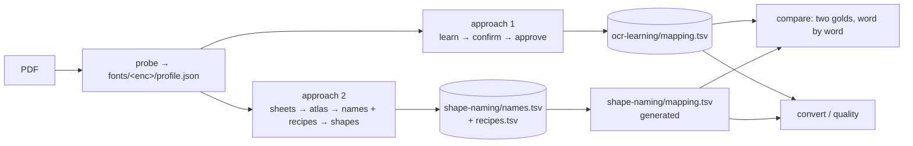

# Conversion approaches

Two ways to build a glyph-to-Unicode mapping for an ASCII-encoded Telugu font. Both run on the same core (`glyphs`, `convert`, `telugu`, `quality`, `probe`), and each lives in its own package.

| | Approach 1: OCR learning | Approach 2: shape naming |
|---|---|---|
| Package | `anu_unicode.ocr_learning` | `anu_unicode.shape_naming` |
| Commands | `learn`, `confirm`, `approve` | `sheets`, `atlas`, `shapes`, `compare` |
| Gold (per font encoding) | `fonts/<enc>/ocr-learning/mapping.tsv` (stack entries) | `fonts/<enc>/shape-naming/names.tsv` + `recipes.tsv` |
| Who labels | Tesseract on words; a human confirms suspects | a human names each glyph code once, from contact sheets |
| Size on Mahabharatamu | ~650 entries | 207 names + 50 recipes |
| Use when | a quick first pass on many pages, or to confirm a mapping against OCR | a new font: small, explainable, and catches systematic OCR errors |

## Layout
- `fonts/<encoding>/` is true for every book in that font encoding: `profile.json` (which font families use it, plus the ink band) and both approaches' gold. `shape-naming/mapping.tsv` is generated by `anu-unicode shapes` and not committed.
- `books/<pdf-slug>/` belongs to one PDF run: learn state (`progress.tsv`, `pending.tsv`, `suspicious.tsv`), `ocr-cache/` and `verified/`. Not committed.
- `--font` (default `anu`) and `--pdf` pick both folders; explicit path options still win.

## Cross-checking the two golds
`anu-unicode compare` converts every word with both mappings and groups the differences, with Tesseract's vote and the shape names of each glyph.
On Mahabharatamu the two golds agree on all 77,191 words; the comparison found ~250 errors in the approach 1 mapping along the way (`docs/specs/shape-names-recipes/validation.md`).
`scripts/compare_outputs.py` diffs a mapping's conversion against page texts saved by an earlier run.

## Specs
- Approach 1: `docs/specs/anu-telugu-to-unicode/`
- Approach 2: `docs/specs/shape-names-recipes/`
- This layout: `docs/specs/approach-refactor/`
- Combining both for a new file (planned): `docs/specs/hybrid-bootstrap/plan.md`
