# Converting 11,000 pages of ASCII-font Telugu to Unicode, and not trusting OCR to check it

Old Telugu books were often typeset in "Anu" fonts. The PDF looks perfect, but the text layer is nonsense: the glyph drawn for the Telugu word నైమిశారణ్యమునకు is stored as the Latin-looking string `<≥·q∞âß~°}º=Ú#‰õΩ`. Copy it out of the PDF and you get garbage. Search is impossible, and nothing downstream (translation, indexing, screen readers) can use the book.

This post is about a small Python tool, `anu-unicode`, that converts such PDFs to correct Unicode Telugu. It converted a corpus of 16 books (a 15-volume Mahabharatam plus one earlier single book) with no human proofreading of the whole text. The interesting part is not the conversion, which is a table lookup. It is how we learned the table and how we knew it was right. We started by trusting OCR and found out why that is a trap.

The numbers come from the repository and from commands run while writing this. The last section lists the source of each one, and the text separates what was measured from what is inferred.

## 1. The problem: a font is an encoding

An Anu font is a normal font whose glyph slots hold Telugu shapes instead of Latin ones. Byte 0x56 draws a Telugu letter, not "V". The PDF records bytes, not letters, so the text layer is the byte string.

A few facts about Telugu script explain why the mapping is not one glyph to one letter:

- A **conjunct** (two consonants fused, as in ష్ఠ) is a consonant, a **virama** (the sign that kills the inherent vowel), and a second consonant. In an ASCII font a conjunct is usually drawn from several glyphs: a base and a subscript form.
- Some **vowel signs sit before the consonant** on the page but come after it in Unicode. The sign ె in మనకెట్టి is drawn to the left of the letter it belongs to, so the glyph order in the PDF is not the logical order.
- A virama that should stay **visible** at the end of a word (మహాన్‌) needs a **zero-width non-joiner (ZWNJ)** after it. Without it a renderer may fuse the virama with whatever follows.
- Some glyphs are **pieces**: a tick, a tail, a ring. They mean nothing alone and combine with neighbours.

So the target is a mapping from sequences of glyph codes to Unicode, plus a few ordering rules. A reader can see whether the output is right, but a program cannot, and nobody wants to proofread 11,000 pages.

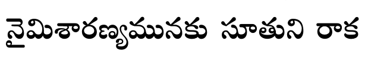

*Figure 1a. Look at the crop, then at the raw text the PDF holds for it, in the table below. Cropped from page 30 of the single-book PDF; one line only.*

| Case | What the viewer sees | Raw text layer (copy-paste) | Converted |
|---|---|---|---|
| Conventional (Mahabharatamu, p. 30) | the line above | `<≥·q∞âß~°}º=Ú#‰õΩ ã¨∂`«∞x ~åHõ` | నైమిశారణ్యమునకు సూతుని రాక |
| Type1 layout (Vol 8, p. 120) | figure 1b | `鬴¤†“ íı®Ω´ §ƒçúø´¤` | కావునఁ గౌరవ పాండవు |
| Type3 front matter (Vol 1, p. 5) | figure 1c | control characters such as `\x8e\x8f\x91\x90`, different on every page | not decodable by this tool; skipped |

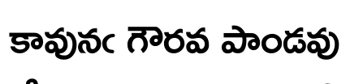

*Figure 1b. Three words from Vol 8 (the Type1-layout case). The last letter of the first word is the arasunna ఁ, which OCR later misread as a slash.*

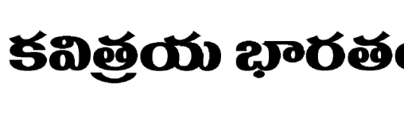

*Figure 1c. A heading line from Vol 1's front matter. Its font is Type3, whose codes are arbitrary per page, so no Anu mapping applies.*

## 2. The first idea: learn the mapping with OCR

The obvious plan was: run Tesseract (Telugu model) on a page, align OCR words with the PDF's own garbled words, and learn which glyph sequence produces which Unicode. When OCR is unsure, ask a human. That became approach 1 (`learn`, `confirm`, `approve`). It grew a mapping of 689 entries today (`fonts/anu/ocr-learning/mapping.tsv`; about 650 when the first book was done).

It worked, and it produced a mapping that looked fine. The trap is that **Tesseract is wrong on Telugu in systematic ways**, and a learner that trusts agreement turns systematic errors into mappings:

- ఘ read as ధ, ఛ as చ, ఢ as ధ, ఔ as జె
- ష్ఠ read as ష్ట (135 words in the book)
- the arasunna ఁ read as `(` or `/`
- ఇట్లు read as ఇట్టు, యుద్ధం as యుద్దం

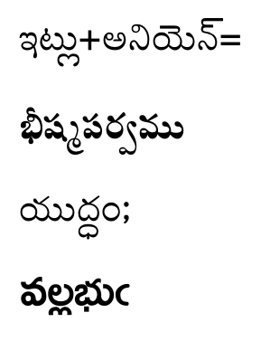

*Figure 2. Four real disagreements between Tesseract and the conversion in Vol 8, pages 100-129 (rows in the table below, in the same order). The converted text matches the print in every one of these; Tesseract does not.*

| Row | Print and conversion | What Tesseract read | Page |
|---|---|---|---|
| 1 | ఇట్లు+అనియెన్‌= | ఇట్టు+అనియెన్‌= | 101 |
| 2 | భీష్మపర్వము | భీష్మపర్వను | 101 |
| 3 | యుద్ధం; | యుద్దం; | 100 |
| 4 | వల్లభుఁ | వల్లభు/ | 100 |

The data are mixed. On the first book, `quality` over 79 cached pages measured 91.3% word agreement between Tesseract and the conversion, yet page 6 alone, which was proofread by hand, had a 63.6% Tesseract word error rate. Tesseract is useful as a signal and bad as a judge. The damage was real: the human confirmed about 150 words over 8 rounds, and wrong mappings (`B` to జె instead of ఔ, `Q` to గే, `Ò` to రౌ) sat in the table from the first pass and surfaced only when a word looked wrong. A wrong entry looked "confirmed" because OCR was wrong in the same way.

There is a second weakness. Approach 1 learns whole glyph stacks, not components. A stack like `Q` to గే swallows the pre-base sign of the next letter. The learner then needs compensating entries, and each is a place to be silently wrong.

## 3. The second idea: OCR is a witness, not the oracle

The root cause was that we asked OCR a question whose answer needs a person: what shape is this glyph? That is a small question. One Anu encoding has a few hundred glyph codes. A person can name each one once, by looking at it, and need not read a word.

Approach 2, "shape naming", is built on that:

1. `sheets` and `atlas` render every glyph code from the PDF's own embedded font, highlighted in red inside the commonest words that contain it.
2. A human gives each code a **shape name** (`va_base`, `u_hook`, `tick_pa`) and says what Unicode it contributes (nothing, a letter, a `◌` placeholder for a pre-base piece, or `∅` for a stray stroke that should be silent).
3. A few **recipes** cover glyphs that only mean something together (`va_base u_hook` is మ).
4. `shapes` compiles names and recipes into a mapping, and rejects ambiguous names, redundant recipes and conflicting output.

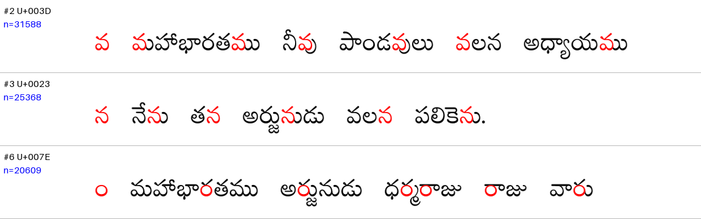

*Figure 3. Look at the red glyph in each word and the code on the left. The person decides what that shape is called, once. From the `sheets` output. The words are short ordinary words, shown at contact-sheet size.*

The gold now has 222 named codes and 67 recipes (`names.tsv`, `recipes.tsv`) against OCR learning's 689 entries. When the first book was finished it was 207 names and 50 recipes. Tesseract is still used, but only as a witness: its disagreement is a reason to look again, never a reason to change a name.

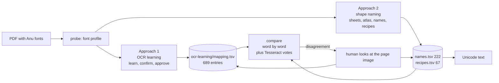

## 4. The cross-check: where OCR's errors showed up

The two golds were built independently, so they make a good test of each other. `compare` converts every word with both and groups the differences with the shape names of the glyphs involved, plus Tesseract's vote when available.

The numbers for the first book (77,191 words, 449 pages), from `docs/specs/shape-names-recipes/validation.md`:

| Round | Words that differ from the shape mapping |
|---|---|
| 1 | 241 (0.31%) |
| 2 (after the project owner fixed reference errors) | 10 (0.013%) |
| 4 | 0 |

The round-1 differences were not noise in the shape mapping. They were errors in the OCR-learned one:

| OCR-learned mapping wrote | Print says | Words |
|---|---|---|
| ష్ట | ష్ఠ (శర్మిష్ఠ, జ్యేష్ఠుడు) | 135 |
| ఫూ | ఘా (ఆఘాతము) | 19 |
| ఫ్రూ | ఘ్రా (ఆఘ్రాణించెను) | 11 |
| గ్గ | గ్ధ (దగ్ధులైన) | 13 |
| ధ్యౌు | ధౌమ్య (ధౌమ్యపురోహితుడు) | 13 |

The project docs count about 250 errors in the OCR-learned mapping found this way, and the validation file's breakdown is 195 reference errors plus 34 cases where the print itself differs from the dictionary spelling (for example గర్బవతులై, printed with బ). Without the shape mapping, OCR agreement alone would have baked them in.

Two of the remaining differences are a good lesson in what a cross-check does and does not tell you. మనకెట్టి was written without ె in the reference, because two compensating errors cancelled out (a glued pre-base glyph in six entries, and a bare `~` that put ె back whenever ర followed). Fixing both changed exactly two words, and the golds then **agreed on all 77,191 words**. పంచయజ్ఞ on page 410 stays wrong in both: the PDF itself draws a ring where the anusvara belongs. We left it as a print glyph slip, because one occurrence is not a rule.

So, as evidence the human-in-the-loop part mattered: the owner confirmed specific words and shapes by eye (మనకెట్టి, పంచయజ్ఞ, ధౌమ్యాదులు, ZWNJ after a visible virama, the bar mark as `||`, ఫో not ఫొ, the stray strokes as silent). The cross-check shows where to look. A person still decides.

One caveat the validation file states: independence is partial, because the plan used aggregate statistics from the reference and the compare loop displayed reference output during iteration.

## 5. How it evolved

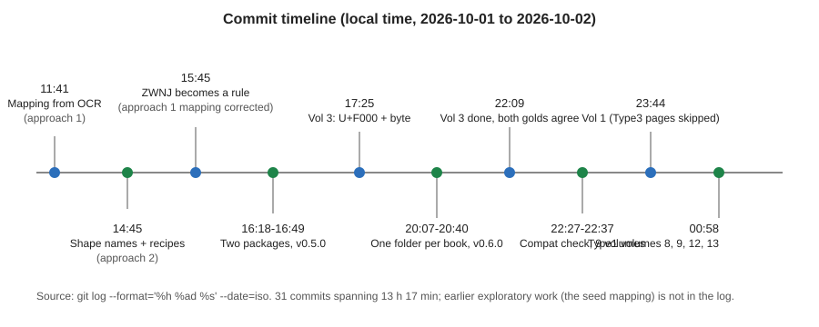

*Figure 4 (SVG). Timeline of commits, from `git log`. 31 commits over 13 hours 17 minutes. Earlier exploratory work (the seed mapping) is not in the log.*

This is a short sketch of the order things happened in:

- **Mapping from OCR (11:41).** The first commit was a finished mapping plus a plan for shape names.
- **Shape names and recipes (14:45).** Iterating against the reference moved glyph coverage from 99.08% (14 recipes) to 100% (48 recipes), and brought the groups of differing words from 8,614 to 170 (51 recipes).
- **ZWNJ becomes a rule (15:45).** Every converter output now gets ZWNJ after a virama that is not followed by a consonant, instead of editing individual mapping entries.
- **Refactor (16:18-16:49).** Two packages (`ocr_learning`, `shape_naming`) on a shared core, one data folder per font encoding.
- **Vol 3 (17:25 onward).** A different packaging of the same encoding (below), then one folder per book with manifests and archives.
- **Compatibility check of all 15 volumes (22:27).** Nine volumes were ready after adding three font families.
- **Vol 1, then the Type1 volumes (23:44, 00:58).**

## 6. Challenges

### Encodings that look the same but are not

Vol 3's PDF stores the same Anu bytes as U+F000 plus the byte, in TrueType fonts. That is a different packaging of the same encoding, so the tool reads it through a profile (`fonts/anu/profile.json`: byte encoding Mac Roman, three overrides). Fonts called Gowthami, Anupama, Dharani and others turned out to be the same encoding in other designs.

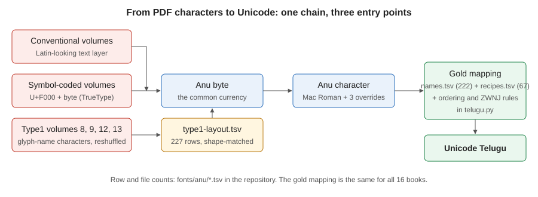

*Figure 5 (SVG). Three kinds of text layer all reach the same Anu byte and the same gold mapping.*

### Volumes 8, 9, 12, 13: the same glyphs on different codes

These volumes mix two layouts by font. Headings are symbol-coded and fine. The body text is in Type1 fonts that carry the same glyph designs as the other volumes' fonts but on a reshuffled set of codes. Anu byte 0x41 is on `V`, 0x45 on `W`, and so on. There is no formula: it is not cp1252, Latin-1, Mac Roman or the Adobe standard order. Converting them as if they were Anu gave garbled words that still looked 93% covered, which shows how misleading coverage alone is.

The fix did not need a second gold. The layout is the same across all copies of a font, across three font families and across the four volumes, so one translation table (`fonts/anu/type1-layout.tsv`, 227 rows) maps each Type1 character to its Anu byte, and the existing gold applies unchanged. The table is built by `scripts/build_type1_layout.py`: render every glyph, compare it with the same families' glyphs in the symbol-coded volumes by overlap (IoU, averaged over families), and solve a one-to-one assignment with the Hungarian algorithm, since every Anu byte occurs exactly once.

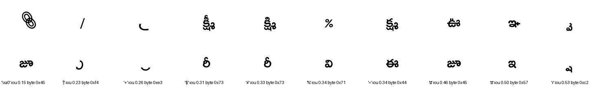

*Figure 6. Top row: Vol 8 glyphs. Bottom row: the best match from Vol 3. These are the ten lowest-IoU glyphs of the scratch run (0.15 to 0.53), not typical ones: the point is how little separates some candidates. From a scratch comparison image.*

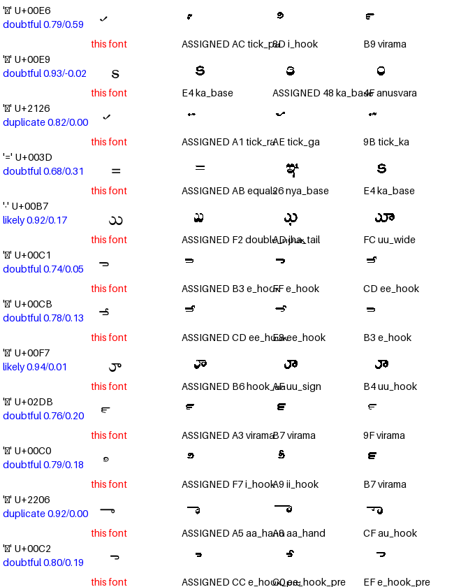

*Figure 7. A Type1 review sheet. Each row is a character with its score and status; the columns show the glyph in this font and the candidate Anu glyphs. The statuses read `doubtful`, `likely`, `duplicate`.*

Here the evidence is mixed. The table's status column holds 12 `sure`, 188 `likely`, 22 `doubtful` and 5 `duplicate` rows, and one row has a manual override. The design doc says the 25 most ambiguous characters were settled by counting real words, not by eye: for each candidate byte, the share of Vol 8-9 words that convert to a word seen in the other 11 volumes. Margins were large (ె at 75% against ే at 3%), and one character, `–`, turned out to draw శ. A visual check of those 25 is still on the list of things not done.

### Type3 front matter

Vol 1's pages 1, 3-19, 21 and 22 (20 pages in the manifest) use one Type3 font per page with arbitrary control-character codes, so no Anu mapping can decode them. The converter skips Type3 text, logs a warning on every run, and records the pages in the manifest. The body of Vol 1 (from page 23) uses the Vol 3 encoding and converts fully. Those 20 pages still need another route, such as OCR or glyph clustering. Neither is built.

### Invisible-character bugs

The hardest bugs to see were ones where the text looked right in a page render but was wrong underneath: ZWNJ missing after a visible virama (8 words), a pre-base ె glued to the wrong letter, subscripts stored in a non-canonical order (7 words corrected by one normalisation rule), and a virama glyph drawn before a subscript but belonging after it (పబ్లికేషన్స్‌). Comparing with Tesseract cannot find these: Tesseract returns the same visible letters either way.

### Look-alike glyphs

Several glyph pairs differ by a tick: థ and ధ, the tickless ఝ in one font family, ఠీ drawn as two pieces. Those were decided by looking at the shape in context with the glyph highlighted. In the Type1 table the same problem showed up as 22 doubtful rows, decided by a vocabulary test.

### Humans against automation

| Decision | Who made it |
|---|---|
| Name each glyph code by shape | a person, once per code |
| Which spellings are what the print says (యుథిష్ఠిర, వేెంకటేశ్వరరావు) | a person, from the page image |
| Silent stray strokes, ZWNJ rule, `||` for the bar | a person confirmed; the rule applies automatically |
| Spotting which words disagree | `compare`, automatic |
| Type1 table assignment | automatic (IoU plus Hungarian); 22 doubtful rows settled by a vocabulary test |
| Nine "ready" volumes | human confirmed 4 new names, 6 recipes and 45 places visually, by reviewing sheets |

## 7. Metrics

Measured from manifests, `book.txt` files and the TSV files on disk.

| Metric | Value |
|---|---|
| Books converted | 16 (15 volumes plus Mahabharatamu) |
| Pages converted | 11,083 (10,634 in the 15 volumes, 449 in Mahabharatamu) |
| Words converted | about 3.1 million (3,107,822 whitespace-separated tokens in all `book.txt` files; includes page numbers and headings) |
| Coverage (glyph sequences mapped) | 100% in all 16 manifests |
| Unmapped glyph sequences | 0 in all 16 manifests |
| Vol 1 pages skipped on purpose | 20 (Type3 front matter) |
| Named glyph codes / recipes | 222 / 67 |
| OCR-learning mapping | 689 entries |
| Type1 translation table | 227 rows |
| Agreement of the two golds | all 77,191 words of Mahabharatamu and all 107,903 words of Vol 3 (per the docs) |
| Unit tests | 180 passed (run while writing) |
| Source size | about 2,600 lines of Python in `src/anu_unicode` (excluding the unfinished `scan/` package) |

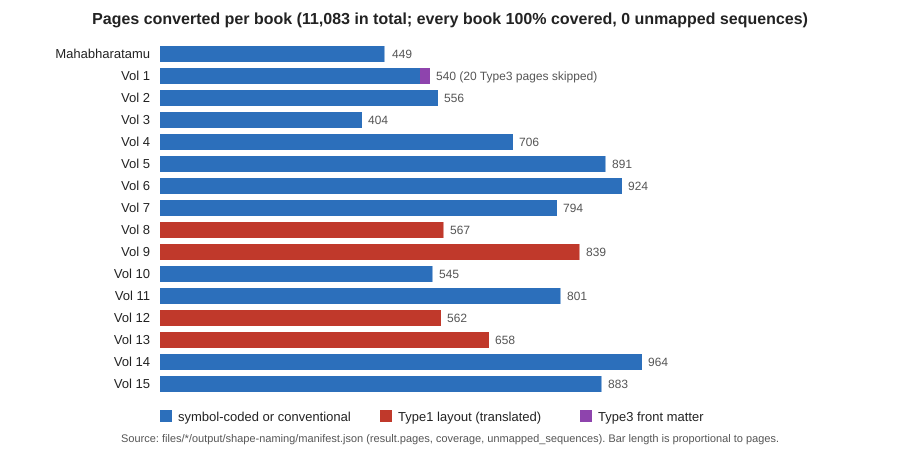

*Figure 8 (SVG). Pages converted per book from the manifests. Colours show how the text is stored.*

"Coverage" here means every glyph sequence found in the PDF maps to something. It does not mean the output is correct. For correctness the evidence is:

| Check | Result | Status |
|---|---|---|
| Two independent golds, word by word | agree on all words of Mahabharatamu and Vol 3 | from the docs, 2 of 16 books |
| Tesseract agreement, Vol 8 pp. 100-129 | 87.7%; every disagreement inspected was Tesseract's | measured, 1 book, and "inspected" is by the author of the doc |
| Tesseract agreement, Vol 8 pp. 50-52 (re-run for this article) | 93.0% (847 of 911 matched words) | measured, 3 pages |
| Share of words not seen in the other volumes | 16-22.5% for the four Type1 volumes; 20-21.5% for conventional volumes, tested leave-one-out | measured; a proxy for plausibility, not accuracy |
| Unmapped sequences | 0 in all 16 books | measured; says nothing about wrong mappings |
| Full ground-truth proofreading of all volumes | not done | open |

There is no accuracy figure for the whole corpus because there is no ground truth for it. The strongest statements the evidence supports are that the mapping reproduces the print for the handled cases, and that every place where an independent source disagreed was investigated.

## 8. Speed

Measured on the author's Windows machine with the project venv, using `--pages` so runs go to scratch folders and never touch final output.

| Measurement | Result |
|---|---|
| `convert --method shape-naming --pages 101-200`, three books, two runs each | 3.4 to 4.3 s per 100 pages including process start (about 23-29 pages/s) |
| Tesseract via `quality --ocr-missing --pages 50-52`, Vol 8 | 15.4 s for 3 pages, including the conversion; about 5 s/page as an upper bound |
| Whole-book timestamps in the manifests | the 15 books after Mahabharatamu (10,634 pages) have "created" stamps spanning 214 s, about 50 pages/s if they ran back to back (an inference) |

Estimates, not measurements: a 900-page volume takes roughly 35 s at the 100-page rate, less if process start-up dominates, and about 75 minutes with Tesseract at 5 s/page. The OCR cost matters because approach 1 needs OCR while learning and approach 2 does not.

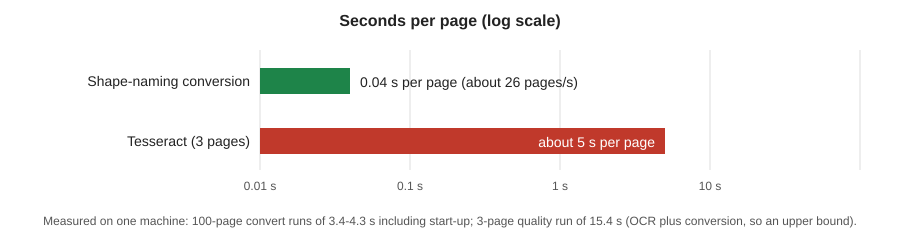

*Figure 9 (SVG). Seconds per page on a log scale, from the measurements above.*

## 9. Re-usability

Most of the code is generic. Only data is specific to a font, and the tool shows that boundary.

| Layer | Reusable? | Where |
|---|---|---|
| Glyph extraction, conversion engine, manifests, compare, quality | generic | `glyphs.py`, `convert.py`, `quality.py`, `shape_naming/compare.py` |
| Script rules (reorder pre-base signs, canonical subscripts, ZWNJ) | generic for Anu-style fonts; a font with a different layout needs a new rule | `telugu.py` |
| Font encoding data | specific to one encoding | `fonts/<encoding>/profile.json`, `shape-naming/names.tsv`, `recipes.tsv` |
| Per-book quirks (Type1 layout, plain pages) | specific to one book | `fonts/anu/books/<slug>.json`, `type1-layout.tsv` |

The playbook for a new font (in `docs/specs/anu-telugu-to-unicode/new-font-playbook.md`, an untracked file in this working tree) says:

1. `probe` the PDF: fonts, which glyphs are marks, the ink band. Write a profile and drop non-Telugu fonts.
2. `sheets` and `atlas`: one row per glyph code, drawn from the embedded font. A person names each shape.
3. Add recipes for visual composites only, run `shapes` to compile.
4. `compare` against any other mapping and iterate on the biggest groups.
5. Optional: OCR learning to confirm the mapping.

For a new book in a known encoding the work is smaller: add its font families to the profile, run `convert`, and review the rare codes. That is how nine volumes were done: three families added, then four glyph names, six recipes and a few dozen visual decisions. For a Type1-style reshuffle, `scripts/build_type1_layout.py --target <book> --reference <books with symbol-coded fonts>` builds the translation table and writes review sheets.

On an Anu-like encoding the cost is mostly looking at contact sheets and naming shapes. On a different script it would be a different gold and different rules. We did not time the naming work, so we give no figure for it.

## 10. Limitations and what is still open

- No full ground truth. Accuracy of the 16 books is inferred from agreement and plausibility, not measured.
- Only Mahabharatamu and Vol 3 are documented as agreeing under two golds. The nine ready volumes were compared against gold 1 too, but gold 1 never learned them (59 distinct unmapped sequences), so that comparison is weaker. The Type1 volumes were converted with the shape gold alone; there the check is OCR on Vol 8, vocabulary and inspection. For the nine ready volumes the status file counts 55 real disagreements between the two golds and says gold 2 was right in all those the author checked (not all 55 are stated as checked).
- OCR agreement was measured on Vol 8 only (three pages in this run, 30 in an earlier one).
- 25 ambiguous Type1 glyphs were settled by a vocabulary test, not by eye.
- The 20 Vol 1 front-matter pages are skipped.
- Type1-layout page detection is manual: page 425 of Vol 13 uses conventional fonts and was found by a per-page scan of unseen-word share. A font-level detector would be better.
- Print quirks are kept as printed (పంచయజ్ఞ, నిరఝరము for the dictionary form నిర్ఝరము).
- The `hybrid-bootstrap` plan, which would combine both approaches for a new file, is only a plan.

## 11. Lessons

1. **Do not use a noisy oracle to define the target.** OCR is fine as a witness. When the same system generates and checks, its systematic errors look like agreement.
2. **Ask people small questions.** "What is this glyph called?" is a few hundred questions. "Is this word right?" is a few million.
3. **Two independent methods are worth more than one careful one.** The cross-check found roughly 250 errors that no amount of care in approach 1 had.
4. **Coverage is not correctness.** The Type1 volumes showed 93% coverage while garbled.
5. **Put variation in data, rules in code.** Three kinds of text layer reached one gold through a lookup table, not three converters.
6. **Prefer rules to entries for invisible things.** ZWNJ and ordering became pipeline rules, so one rule replaced dozens of entries.
7. **Be calibrated.** The honest answer to "how easily did it overcome OCR mistakes?" is that detecting them was easy once there was a second method, fixing them took a few rounds of human review, and the claim stops at "agreement", not "proved correct".

## Sources for the numbers

| Number | Source |
|---|---|
| Pages (11,083; 10,634), coverage, 0 unmapped, 20 Type3 pages | `files/*/output/shape-naming/manifest.json`, fields `result.pages`, `coverage`, `unmapped_sequences`, `skipped_type3_pages` (summed with a short Python script) |
| Words (3,107,822) | whitespace split of `files/*/output/shape-naming/book.txt` |
| 222 names, 67 recipes, 689 mapping entries, 227 table rows | data rows of `fonts/anu/shape-naming/names.tsv`, `recipes.tsv`, `fonts/anu/ocr-learning/mapping.tsv`, `fonts/anu/type1-layout.tsv` (counted without header or comment lines) |
| Type1 table statuses (12/188/22/5, 1 confirmed) | column 6 and 7 of `fonts/anu/type1-layout.tsv` |
| 207 names, 50 recipes, 648/654 entries, 77,191 words, 241 then 10 then 0 differing words, 135/19/11/13/13 word groups, 195 + 34 | `docs/specs/shape-names-recipes/validation.md` |
| 99.08% to 100%, 14 to 48 recipes, 8,614 to 170 groups | `docs/specs/shape-names-recipes/status.md` |
| About 250 errors in approach 1 | `docs/approaches.md` |
| 150 words over 8 rounds | `docs/specs/anu-telugu-to-unicode/new-font-playbook.md` |
| 91.3% agreement over 79 pages | `docs/specs/ocr-quality-report/status.md` |
| 63.6% Tesseract word error on page 6 | `validation.md`, caveats |
| Vol 3: 107,903 words, both golds agree | `docs/specs/vol3-sabha-parvam/status.md` |
| Vol 8 87.7% (pp. 100-129), 16-22.5% vs 20-21.5%, 25 ambiguous glyphs, ె 75% vs ే 3%, page 425 | `docs/specs/set-compatibility/type1-layout.md` |
| 4 names, 6 recipes, 45 places, 55 real disagreements | `docs/specs/set-compatibility/status.md` |
| Vol 8 pp. 50-52: 93.0%, 847 of 911 | measured: `anu-unicode --book maha-bharatham-vol-8-bheshma-parvam quality --method shape-naming --pages 50-52 --ocr-missing` (report in the book's `output/intermediate/quality`) |
| Conversion speed (3.4-4.3 s per 100 pages) | measured: `anu-unicode --book <slug> convert --method shape-naming --pages 101-200` for `mahabharatamu`, `maha-bharatham-vol-8-bheshma-parvam`, `maha-bharatham-vol-3-sabha-parvam`, timed with `time`, two runs each |
| Tesseract 15.4 s for 3 pages | measured: the `quality` command above, timed with `time` |
| About 50 pages/s from timestamps | `created` field in the manifests (inferred, assumes back-to-back runs) |
| 35 s and 75 min per 900-page volume | estimates computed from the rates above |
| 31 commits, 13 h 17 min, timeline | `git log --format='%h %ad %s' --date=iso` |
| 180 tests | `.venv/Scripts/python.exe -m pytest -q` |
| 2,600 lines of Python | `wc -l` over `src/anu_unicode/**/*.py`, excluding `scan/` |
| Figure data | Figure 8: manifests; Figure 9: the speed measurements; Figure 3 and 7: scratch and `files/` outputs of the type1 builder |
