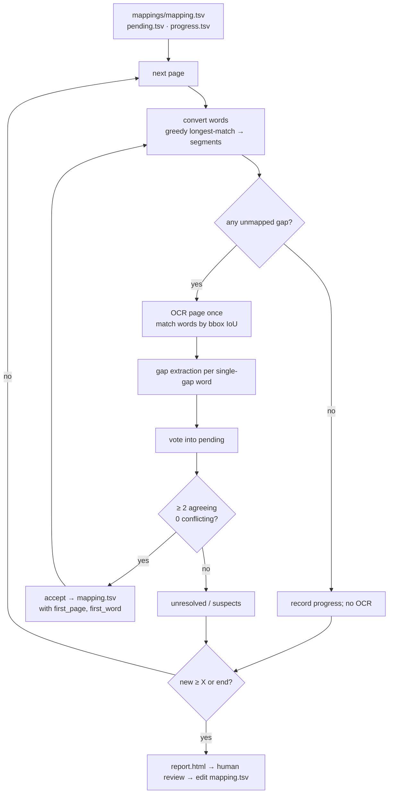
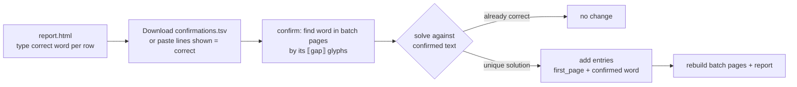
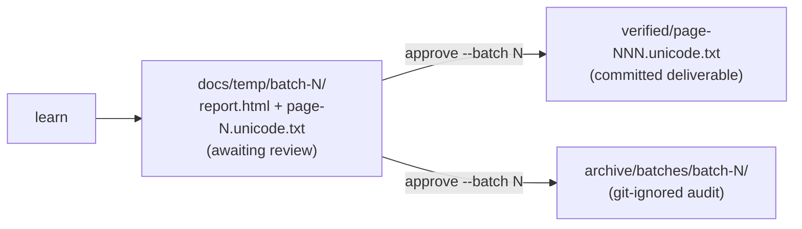

# Design: Anu (ASCII) Telugu PDF → Unicode, incremental mapping discovery

## Problem & goals
`Mahabharatamu.pdf` (449 pages, PageMaker 7.0) is set in Anu Script Manager fonts (Priyaanka, PriyaankaBold, PallaviBold,
Prabhava, Pragathi, Kranthi). Its text layer holds glyph codes, not Unicode. Conversion is a **glyph-sequence → Unicode**
mapping applied longest sequence first.

Goal: grow that mapping **page by page**, starting from a seed. Use OCR **only for glyph sequences not yet mapped**.
Accept consistent findings automatically, and keep an audit trail. Batches stop after X new entries for human review.

## Requirements / constraints
- Seed = current working mapping (548 entries). Seed entries carry no audit data.
- A new entry records its **first occurrence** (page + OCR'd word).
- Existing entries are never overwritten automatically.
- A batch stops after the page on which X new entries are reached; the next batch resumes where it stopped.
- Local and repeatable (Tesseract 5.4 `tel`, no cloud OCR).

## Key facts from the PDF
| Finding | Consequence |
|---|---|
| Raw codes are reassigned per font subset, but glyph names are consistent | Key = per-glyph char from PyMuPDF `rawdict`, never the raw byte |
| Copy-paste text maps `dieresis` to space + U+0308 | Always extract per glyph |
| `,` is a glyph | State files are TSV |
| Anu fonts declare ascent 1 / descent 0 | Glyph boxes rebuilt as `baseline − 0.75·size … + 0.35·size` so they overlap OCR boxes |
| Subscripts (ఒత్తులు) and ృ are drawn **under** the base but stored **after** the vowel sign | `normalise`: vowel sign + `్C…` → `్C…` + vowel sign; drop spaces before combining marks |
| Tesseract confidence is lowest on rare conjuncts, the very words we need | Confidence does not gate learning, only the suspect report |
| Tesseract has systematic blind spots (ఛ→చ, ఢ→ధ, ఘ→ధ, digits) | Human review of each batch report stays in the loop |

## Proposed approach

### Anchored gap extraction
`convert_segments` returns `[(glyphs, unicode | None)]` before normalisation. Adjacent unmapped glyphs form one gap.
In a word with **exactly one gap**, the known segments on both sides fix the answer:

1. Candidates: strip the known prefix and suffix from the OCR word, read both as-is and `denormalise`d (Anu order).
   The Anu-order reading covers subscripts drawn after a vowel sign (`` `å ⟦¯⟧ `` vs OCR త్కా → `్క`).
2. **Verification:** keep a candidate only if `normalise(prefix + candidate + suffix) == OCR word`.
   A word whose OCR contradicts a known glyph (e.g. బుషి for ఋషి) yields nothing. That is conservative by design.
3. A word votes once, and only when exactly one candidate survives.
4. After each acceptance the page is re-converted. Multi-gap words shrink to single-gap words and vote, until nothing changes.

### Acceptance and refinement
- Accept when a glyph string has one proposed value, supported by **≥ 2 distinct contexts** (the known letter before|after the
  gap), and no competing value. Repeats of the same context are correlated (same visual stack, same OCR confusion), so they count
  once. Otherwise the proposal stays in `pending.tsv`, carried across pages and batches.
- **Pre-base glyphs** (`„` = ్ర, typed before its consonant) map to `◌్ర`. `normalise` moves it after the following consonant cluster.
- **Suspect words:** fully mapped words whose conversion differs from confident OCR (≥ 60) are listed in the report with crops.
  Corrections are made by hand in `mapping.tsv`, never automatically.

### State files (`mappings/`, LF, committed)
| File | Columns |
|---|---|
| `mapping.tsv` | `glyphs unicode first_page first_word` (audit empty for seed entries) |
| `pending.tsv` | `glyphs unicode count first_page first_word` |
| `progress.tsv` | `page glyphs unmapped_before unmapped_after new_entries`; the next batch resumes after the last page |

### Human confirmations (`confirm --batch N`)

The confirmed word replaces OCR as the target, and because it is trusted the solver may do more than the learner:
- **Multi-gap words** are solved together (సం⟦H⟧్ష⟦À⟧భము → `H→క`, `À→ో`).
- **Widening:** if the gap alone has no non-empty solution, it is merged with one neighbouring segment, **right first**
  (pre-base pieces belong to the next letter: `ÔH· → కై`, `ˆQ → గే`), then left (`iî → ఠి`). At least one known segment
  must stay outside the span, so a confirmation can never re-map a whole word.
- Candidates are every substring of the target in its possible Anu orders (subscript after sign, pre-base `◌్ర`, NFD), each verified
  by `normalise(...) == confirmed word`. Canonically equal candidates count once.
- `·` maps to the length mark `ౖ`; `normalise` ends with NFC, so `ె + ౖ` becomes `ై` for every consonant.

### Folder lifecycle

- `docs/temp/` holds **only unreviewed batches** (git-ignored).
- `verified/` holds human-approved page outputs, zero-padded (`page-006.unicode.txt`), LF.
- `archive/` holds approved batch reports and retired experiments (git-ignored).

### Modules
`glyphs` (extraction) · `convert` (segments, render, normalise) · `telugu` (script rules) · `ocr` (Tesseract, bbox match) ·
`mapping` (state files) · `solve` (gap solving) · `learn` (voting, page loop, batch, review) · `confirm` (human confirmations) ·
`report` (HTML with confirmation export) · `approve` (verified + archive) · `profile` / `probe` / `atlas` (new-font tooling, see
`new-font-playbook.md`) · `cli` (`learn`, `confirm`, `approve`, `convert`, `quality`, `probe`, `atlas`).

## Alternatives considered
- **Bulk EM alignment (v0.1).** Joint EM over all OCR'd words on pages 6–60, then review. It reached 100 % on pages 6–10 and produced
  today's seed. Retired because it re-learns everything each run, folds OCR noise into known entries and has no audit trail.
  With a rich seed, anchored gap extraction is simpler and exact.
- **Pixel projection ("light from top").** Ink columns split inside letters and merge across them. Glyph advances from the PDF
  are more precise.
- **Tesseract confidence ≥ 60 as a gate.** It rejected correctly read rare conjuncts (జరత్కారుని at 21 and 50). Replaced by
  verification against the known neighbours.

## Open questions
- Should `ˆ` / `Ô` (pre-base ే / ె) be modelled like `„`, replacing per-consonant compensation entries such as `Q→గే`?
