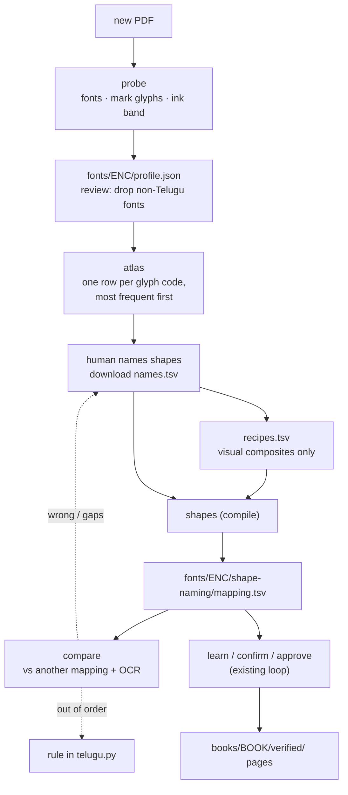

# Playbook: mapping a new ASCII-Telugu font

Written after converting `Mahabharatamu.pdf` (Anu fonts, 449 pages). It records what we would do differently and what is already built.

## Retrospective: where the time went
Roughly 150 words were hand-confirmed over 8 rounds. Several wrong mappings (`B→జె`, `Q→గే`, `Ò→రౌ`) sat in the mapping from the first pass
and only surfaced when a word looked wrong.

| What happened | Cost | Do this instead | Status |
|---|---|---|---|
| Discovery started from OCR. Tesseract is wrong in a *systematic* way on the hard glyphs (ఔ→జె, ఘ→ధ, ఛ→చ, ఢ→ధ). | Wrong entries looked "confirmed" because OCR agreed with itself. | Start from a **glyph atlas** drawn from the embedded font; a person labels each unit once. OCR only confirms. | **Built** (`atlas`) |
| Whole stacks were learned (548 entries) instead of components. | Compensation entries (`Q→గే`, `` `«ˆ→త ``) swallowed neighbouring pre-base signs. | Label **components** (consonants, matras, subscripts, pre-base pieces) and compose by rule. | Atlas lists units; composition rules exist in `telugu.py` |
| Ordering rules were found one failure at a time. | A round of confirmations per rule. | **Probe** the font's anatomy first: which glyphs have zero advance (marks), where the ink sits. | **Built** (`probe`) |
| Seed was 548 unreviewed learned entries. | Pages 6–10 read "100%" while wrong entries were hidden. | Seed small and reviewed; everything else carries an audit trail. | Process |
| First pages were the table of contents. | Low glyph diversity; false confidence. | Order pages by **new-glyph yield**; one page per font and style. | Not built |
| No lexicon. | Only OCR could flag a bad word (జెషధులు is not Telugu). | Add a word-list check to the suspect report. | Not built |
| OCR cache, distinct-context rule, LF line endings, audit columns came late. | Re-OCR and re-work. | Present from day one. | Done in this repo |

## Workflow for a new font

1. **Probe** the PDF: `anu-unicode --pdf NEW.pdf probe --write fonts/ENC/profile.json`.
   It lists every font with page and glyph counts, proposes which are Telugu (Latin, symbol and dingbat fonts are filtered by name; check the list),
   lists zero-advance glyphs (the marks), and measures the ink band from the font outlines.
2. **Review the profile.** Remove any non-Telugu font the name filter missed (it kept `DingbitsOne` here).
3. **Atlas**: `anu-unicode --pdf NEW.pdf --font ENC sheets` and `anu-unicode --pdf NEW.pdf --font ENC atlas`.
   Each row is one **glyph code** (not a unit: zero-width marks get their own row), drawn from the font program, with its count, the units it appears in and two example words.
   Give each glyph a **shape name** (`va_base`, `u_hook`, `tick_pa`) and the Unicode it contributes on its own: empty if it only means something with neighbours, `∅` if it draws but contributes nothing, `◌` for pieces drawn before their consonant.
   *Download names.tsv* exports every named row.
4. **Recipes + compile**: write `fonts/ENC/shape-naming/recipes.tsv` for visual composites only (`va_base u_hook → మ`), then `anu-unicode shapes`. The compiler rejects ambiguous names, unknown names, redundant recipes and conflicting outputs.
   Glyph order is drawing order: when the output is right but out of order, add a rule to `telugu.py`, not a recipe.
5. **Compare** against any existing mapping with `anu-unicode --font ENC compare` and iterate on the largest groups. For Mahabharatamu this took 207 names + 50 recipes (vs 648 entries); see `docs/specs/shape-names-recipes/validation.md`.
6. **Learn** with the existing loop (`learn`, `confirm`, `approve`) on the compiled mapping, if gaps remain.

## What is reusable, and what is font-specific
- **Reusable:** `glyphs`, `convert`, `solve`, `learn`, `confirm`, `report`, `approve`, `atlas`, `probe`, and the state files.
- **Font-specific, as data:** `fonts/<encoding>/` (profile, plus each approach's gold; see `docs/approaches.md`).
- **Script-level, not font-specific:** the rules in `telugu.py` (subscript after a vowel sign, pre-base `◌` placeholders, joiners).
  Another Anu-style font reuses them. A font family with a different layout (e.g. vowel signs stored before the consonant) needs a rule added there.
  *(An earlier message said these rules belong in the profile; they do not. The placeholders live in the mapping and the reordering in `telugu.py`.)*

## Measured on this book
- 601 distinct glyph units in 489,280 occurrences; the 300 most frequent cover **99.65%**. Building the atlas takes 6.5 s.
- Ink band: probe 0.66/0.34 vs hand-picked 0.75/0.35. Matching PDF words to OCR boxes: **69.7% vs 61.8%** of words
  (27 cached pages; a taller 0.80/0.40 box gives 47.6%). The built-in default is unchanged so this book's results do not shift.

## Before trusting a new font
- Glyph *names* must mean the same shape across the PDF's font files (we relied on this; raw codes differ per subset). Spot-check three glyphs across fonts in the atlas.
- Keep one hand-verified golden page per font and style.
