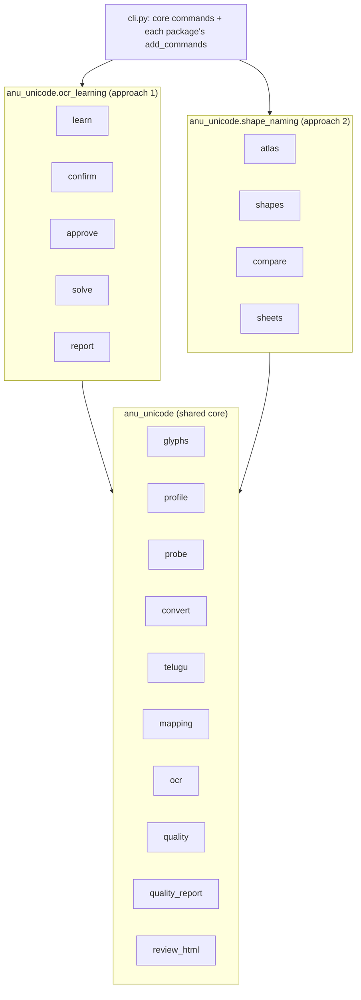
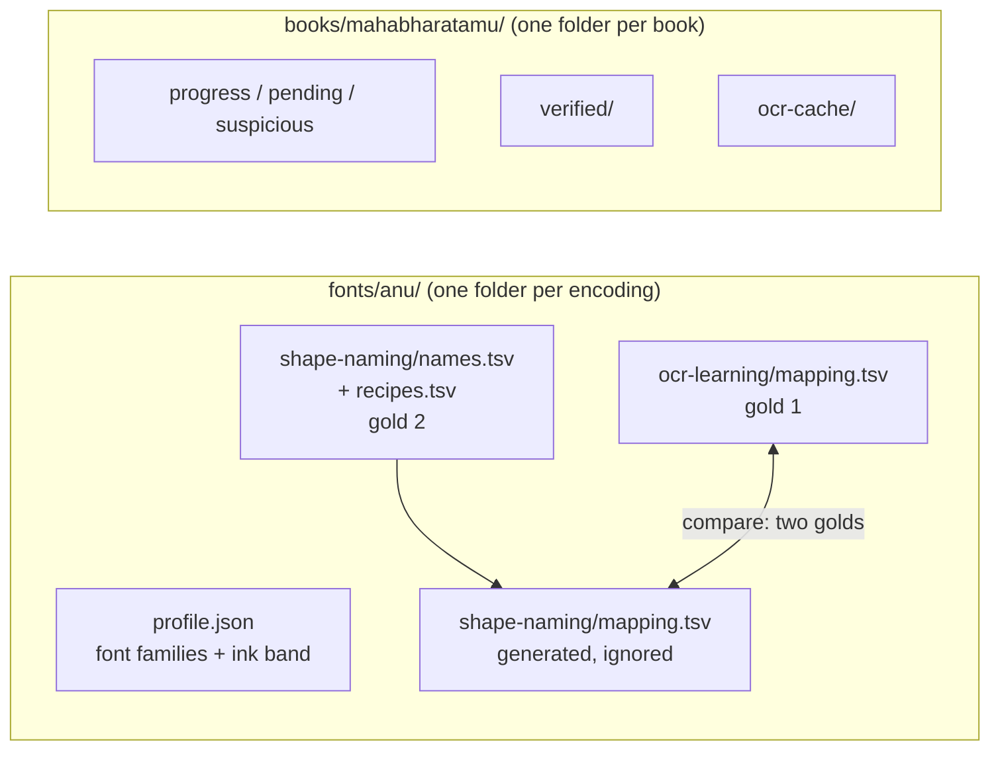

# Design: make the two conversion approaches visible in the code

## Problem & goals
The repo holds two working approaches for converting Anu-font Telugu PDFs, but every module sits flat in `anu_unicode/`, so the code does not show which is which:

| | Approach 1: OCR learning | Approach 2: shape naming |
|---|---|---|
| Commands | `learn`, `confirm`, `approve` | `atlas`, `shapes`, `compare` |
| Unit of truth | whole glyph stacks (~650 entries) | glyph codes (207 shape names) + 50 recipes |
| Labeller | word-level Tesseract + human confirmations | human per glyph, from contact sheets |
| Result on Mahabharatamu | ~250 errors found later | reproduces the corrected mapping on all 77,191 words |

Goals: (1) one package per approach over a shared core, so neither approach imports the other; (2) store mappings per font encoding, with each approach's gold kept separately and book-run state kept per book; (3) promote the reusable tools written in `docs/temp/` during approach 2 and leave the throwaways behind.
Non-goals: behaviour changes, new features, renaming commands or options.

## Requirements / constraints
- A mapping belongs to a font encoding, not to the repo; both approaches' gold artifacts are kept side by side for that encoding.
- Command names unchanged; default paths move with the data layout; outputs unchanged (`compare` still reports 0 differences, gold page 6 still 0 errors).
- `__init__.py` files stay empty; `git mv` keeps history.
- Tests mirror the package layout.

## Proposed approach

| Package | Modules | CLI commands |
|---|---|---|
| `anu_unicode` (core) | `glyphs`, `profile`, `probe`, `convert`, `telugu`, `mapping`, `ocr`, `quality`, `quality_report`, new `review_html` | `probe`, `convert`, `quality` |
| `anu_unicode.ocr_learning` | `learn`, `confirm`, `approve`, `solve`, `report` | `learn`, `confirm`, `approve` |
| `anu_unicode.shape_naming` | `atlas`, `shapes`, `compare`, new `sheets` | `atlas`, `shapes`, `compare`, `sheets` |

- `cli.py` keeps the global options and the core commands. Each package exposes `add_commands(subparsers)`, the pattern `_add_shape_commands` already uses, so `--help` groups commands by approach.
- Tests: `tests/unit/ocr_learning/`, `tests/unit/shape_naming/`; core tests stay in `tests/unit/`.

### Data layout: mappings belong to a font encoding, and each approach has its own gold
A mapping only means something for one font **encoding**. The six fonts in Mahabharatamu (Priyaanka, PriyaankaBold, PallaviBold, Pragathi, Prabhava, Kranthi) share the Anu encoding; so do Vol 3's Gowthami, Anupama and Dharani (see `docs/specs/vol3-sabha-parvam/design.md`).
Today the only link is `FontProfile.anu_fonts` → `Glyph.is_anu`, and one global `mappings/mapping.tsv` serves every Anu glyph. Book-run state sits next to the font's gold mapping.

The two processes each produced a **gold** artifact for the Anu encoding, and both are kept:

| Approach | Gold (hand-maintained, committed) | Generated (rebuilt, not committed) |
|---|---|---|
| 1. OCR learning | `ocr-learning/mapping.tsv` (stack entries, hand-corrected) | — |
| 2. Shape naming | `shape-naming/names.tsv` + `shape-naming/recipes.tsv` | `shape-naming/mapping.tsv` (from `anu-unicode shapes`) |

- `fonts/<encoding>/` holds what is true for every book in that encoding: `profile.json` (replacing the built-in `DEFAULT_PROFILE`; `anu_fonts` becomes the encoding's font-family list) and both approaches' gold.
- `books/<book>/` holds what belongs to one PDF run: the approach 1 learn state (`progress.tsv`, `pending.tsv`, `suspicious.tsv`), `verified/` and the OCR cache.
- CLI: `--font anu` resolves the defaults for `--mapping`, `--names`, `--recipes` and `--profile`; book paths default to `books/<pdf stem>/`. Explicit paths still override.
- `compare` stays symmetric: it diffs any two mappings. It is the cross-check between the two golds.
- The generated `shape-naming/mapping.tsv` is git-ignored and rebuilt by `shapes`. The currently committed `shapes/mapping.tsv` is removed from git.

**Follow-up, if a book ever mixes encodings:** `Glyph.is_anu` becomes `Glyph.encoding` (looked up from each font's family via the profiles), and `convert_line` splits runs by encoding and picks that encoding's mapping. Vol 3 turned out not to need this: its Telugu fonts are all the Anu encoding, stored as U+F000 + byte (`docs/specs/vol3-sabha-parvam/`).

### Dependency fix
`compare.py` (approach 2) imports `learn.Occurrence` and `report._crop/_table/_glyphs/_telugu/STYLE` (approach 1).
The generic HTML helpers move to a core `review_html.py`, and the crop takes `(page, bbox)` instead of an `Occurrence`. Both `report.py` and `compare.py` use it.

### Script triage
| File | Verdict | Destination |
|---|---|---|
| `docs/temp/shapes-sheets/make_sheets.py`: contact sheets with the target glyph highlighted in real words | **Promote** | `shape_naming/sheets.py` + `sheets` command; reuse `atlas.glyph_stats` / `load_fonts` instead of its own counting; with tests |
| `docs/temp/shapes-sheets/show_words.py`: difference words with shape names | **Fold in** | `compare --names shapes/names.tsv` adds a shape-name column to `diff.tsv` and `report.html` |
| `docs/temp/batch-compare/compare_batches.py`: diff a mapping's output against saved page texts | **Promote** | `scripts/compare_outputs.py`, beside `scripts/tesseract_evidence.py` |
| `docs/temp/shapes-sheets/to_names.py`, `labels.tsv` | Throwaway | stay ignored; `shapes/names.tsv` is the source of truth |
| `docs/temp/head/telugu_head.py` | Throwaway | stays ignored; a copy of an old git revision |
| `scripts/tesseract_evidence.py` | Keep | approach 1 evidence tool |
| `scripts/index_glyphs.py`, `glyph_table.html.tmpl` | Keep | scanned-PDF glyph-id POC (neither approach) |

Docs: a short `docs/approaches.md` (the comparison table above and when to use each), linked from `new-font-playbook.md`. Spec folders stay as they are: `anu-telugu-to-unicode` is approach 1 and `shape-names-recipes` is approach 2.

## Alternatives considered
- **Separate distributions per approach:** too heavy; they share most of the core.
- **Prefix module names (`a1_learn.py`):** shows the split but keeps a flat namespace and does not stop cross-imports.
- **Leave flat and document only:** cheapest, but the `compare` → `learn` coupling would remain.

## Open questions
- Whether `solve` belongs in the core: today only approach 1 uses it, but the hybrid bootstrap plan (`docs/specs/hybrid-bootstrap/plan.md`) would reuse it from approach 2. If that plan goes ahead, move it to the core then.
