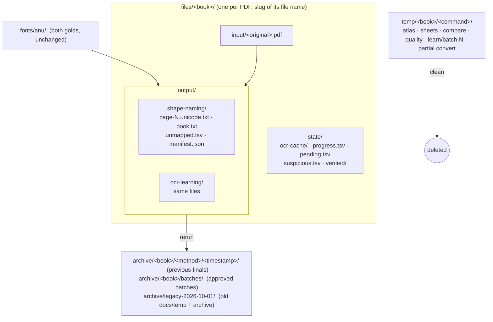

# Design: one place per book for inputs, final outputs, run state, scratch and archives

## Problem & goals
Run artifacts are hard to find:
- Every command writes under one global `--out` (default `docs/temp`, now about 90 MB). Books and methods are mixed together (`batch-1`, `vol3-convert`, `refactor-after`, `shapes-validation`), and nothing records which book, method or mapping produced a folder.
- Every run overwrites the previous one in place.
- One book's files are spread across `files/` (PDFs), `books/<slug>/` (run state), `docs/temp/` (outputs) and `archive/` (approved batches and old experiments).

Goals:
- Each book has **one folder**, `files/<book>/`, named by the slug of its file name, holding its input, its final text per method, and its run state.
- **Final output** per method holds the latest complete-book run, with a manifest. A rerun first archives the previous output.
- **Intermediate files** go to `temp/<book>/<command>/` and can be deleted at any time.
- Old clutter is archived, not deleted.

## Requirements / constraints
- Font assets stay as they are: `fonts/<encoding>/` with both golds.
- Nothing generated is committed. `files/`, `temp/` and `archive/` are git-ignored, and the PDFs are never staged.
- Commands keep their names. Path options become book-relative defaults, and explicit paths still override.
- Conversion output must not change: Mahabharatamu stays byte-identical page for page.

## Proposed approach

### Layout

| Kind | Where | Lifetime |
|---|---|---|
| Input PDF | `files/<book>/input/<original name>.pdf` | permanent |
| Final text per method | `files/<book>/output/<method>/` | latest run; the previous one is archived on rerun |
| Run state | `files/<book>/state/` (OCR cache, learn progress/pending/suspicious, `verified/`) | permanent; reused across runs |
| Intermediate | `temp/<book>/<command>/` (`convert/<method>` for partial runs, `quality/<method>`, `compare`, `atlas`, `sheets`, `learn/batch-N`) | scratch; overwritten per run; `clean` deletes it |
| Archive | `archive/<book>/<method>/<UTC timestamp>/`, `archive/<book>/batches/`, `archive/legacy-<date>/` | kept until removed by hand |

### Selecting a book and a method
- **`--book <slug>`** (required) picks `files/<slug>/`. The PDF is the single `*.pdf` in `input/`. A missing or ambiguous input is an error that names the folder.
  - Adding a book: create `files/<slug>/input/` and put the PDF in it.
  - `--pdf` goes away. A slug is derived once, when the folder is created, and the folder name is the identity from then on.
- **`convert --method shape-naming|ocr-learning`**:
  - Writes to `output/<method>/` only for a complete-book run from that method's gold.
  - A run with `--pages` or an explicit `--mapping` is not final and goes to `temp/<book>/convert/<method>/`.
  - `shape-naming` compiles `names.tsv` + `recipes.tsv` in memory (`compile_mapping`), so a stale generated `mapping.tsv` can never produce a final output.
  - `ocr-learning` reads `fonts/<enc>/ocr-learning/mapping.tsv`.
- **`quality --method`** picks the mapping the same way and writes to `temp/<book>/quality/<method>/`.
- **`compare`** stays a two-gold cross-check and writes to `temp/<book>/compare/`.
- The global `--out` option goes away. The layout decides where each command writes.

### Final output contents
- `page-N.unicode.txt`: the existing page files, unchanged, so `verified/`, `approve` and `scripts/compare_outputs.py` keep working.
- `book.txt`: every page in order, separated by form feeds (`\f`, the pdftotext convention), so the whole book opens as one file.
- `unmapped.tsv`: as today.
- `manifest.json`: book, source file name, PDF sha256, method, gold file paths with their sha256, tool version, UTC time, pages, coverage, unmapped sequences. It answers "which mapping made this text?".
  - The PDF sha256 is checked on every run. A changed PDF is logged as a warning and recorded in the new manifest.

### Archive and cleanup
- **Before a final run writes**, it moves the existing `output/<method>/` to `archive/<book>/<method>/<timestamp from its manifest>/`. A final output is never overwritten.
- **`approve`** moves approved batches to `archive/<book>/batches/` instead of the shared `archive/batches/`.
- **`anu-unicode clean --book <slug>`** deletes `temp/<book>/`; `clean --all` deletes `temp/`. It never touches `files/` or `archive/`.
- **One-off migration** (a step in the plan, not code):
  - each PDF moves to `files/<slug>/input/`;
  - `books/<slug>/*` moves to `files/<slug>/state/`;
  - `docs/temp/*` and the current `archive/*` move to `archive/legacy-2026-10-01/`;
  - final outputs are regenerated for both books and both methods.

### Code
- New core module `layout.py` with `BookLayout(slug)`: `input_pdf()`, `output(method)`, `state`, `temp(command)`, `archive(method, stamp)`, `batches`. `cli.resolve_paths` uses it in place of `BOOKS` and `--out`.
- `convert` gains the method, `book.txt`, the manifest and archive-on-rerun. `learn`/`confirm`/`approve` take their batch folder from `temp(...)` and their archive from `batches`. `atlas`, `sheets` and `compare` write to `temp(command)`.
- `scripts/compare_outputs.py` and `scripts/tesseract_evidence.py`: `--book` replaces their PDF and state defaults.

## Alternatives considered
- **Separate `files/input` and `files/output/<book>` roots:** keeps a book in two places. Rejected in favour of one folder per book.
- **Content-hash folder names:** robust to renames but unreadable. The sha256 lives in the manifest instead.
- **A timestamped folder for every run:** nothing is ever overwritten, but `output/` fills with runs and needs a "latest" pointer. Archiving on rerun keeps `output/` to one obvious answer per method.
- **Keeping `--pdf` alongside `--book`:** two ways to name a book means two slugs for one PDF if the file is renamed. `--book` only.

## Open questions
- The Prasaaskhara PDFs (scanned / text, not Anu) move into their own `files/<slug>/input/` like the others. Only `scripts/index_glyphs.py` uses them; its defaults move to the new paths.
