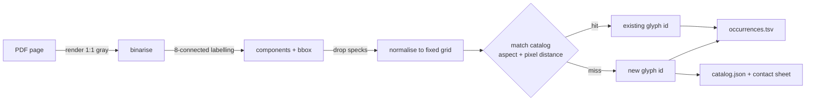

# Design: Image-portion to glyph-id clustering (POC)

## Problem & goals
Scanned Telugu PDFs have no text and no fonts. Instead of OCR-ing every word, give every distinct *image portion* a stable
glyph id once, so that a glyph (or glyph sequence) can later be mapped to Unicode code points by a table, the same way
`mappings/mapping.tsv` maps Anu font glyph sequences today.

POC goal: for one page of `2015.395281.Prasaaskhara-Padakosamu.pdf` (page 4), produce
`image portion -> glyph id`, plus a catalog of the unique glyphs for human review.

Out of scope: Unicode labelling, sequence assembly, production accuracy.

## Requirements / constraints
- Input is a 1-bit CCITT scan; no text layer is used.
- An image portion is a connected component of ink. It is not a letter (vowel signs and conjunct subscripts are separate
  or fused components); the glyph id is a shape identity only.
- Same shape on any page of the same print run must get the same id (catalog is persistent and incremental).
- Reviewable: a contact sheet of one representative per id with its occurrence count.

## Proposed approach

- Render at native image resolution so no resampling blurs the shapes.
- Normalise each component to a 24x24 boolean grid; two components match when their aspect ratios agree within a
  tolerance and the normalised pixel mismatch fraction is below a threshold. First match wins; a miss registers a new id.
- Catalog stores the representative grid per id; occurrences store page, bbox and id.

## Alternatives considered
- Perceptual/feature hashing: cheap but collides on near-identical Telugu forms that differ by a small hook.
- Neural embeddings + clustering: better recall, heavy and unneeded for a clean single-font print.
- Tesseract per component: that is the OCR cost we are trying to avoid.

## Open questions
- Correct thresholds (aspect, mismatch fraction); the POC exposes both as arguments and the contact sheet shows the result.
- Whether touching/fused components must be split (deferred until the contact sheet shows how often it happens).
