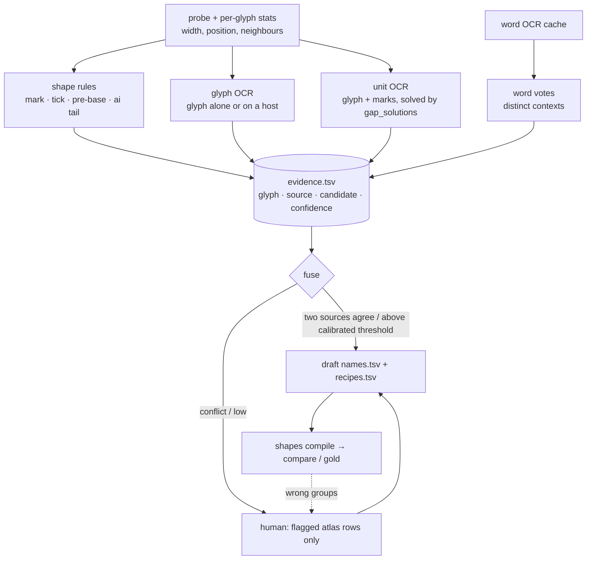

# Plan: hybrid bootstrap for a new Anu file (glyph OCR + shape rules + word OCR)

_Status: future. Starts after `docs/specs/approach-refactor/` is done; it lands in `shape_naming/` and reuses `sheets`._

## Scope
Goal: for a new file, auto-label each glyph code from several kinds of evidence, each with a confidence, so a human reviews only the uncertain residue. This combines approach 1 (OCR, automatic) with approach 2 (shape names, accurate).

Decisions taken:
- Prove it **blind on Mahabharatamu**, where the answer is known (gold 2 `fonts/anu/shape-naming/names.tsv` + `recipes.tsv`, gold 1 `fonts/anu/ocr-learning/mapping.tsv`).
- **Spikes before design.**
- Evidence lives in a separate `fonts/<encoding>/shape-naming/evidence.tsv`; `names.tsv` stays the accepted truth (gold 2).
- No JIRA.

Environment: Tesseract 5.4 with `tel` at `C:\Users\miriyald\AppData\Local\Programs\Tesseract-OCR\tesseract.exe` (pass `--tesseract` or set `TESSERACT_CMD`).

Out of scope here: label transfer to *Maha Bharatham Vol 3 Sabha Parvam* (same Anu encoding as U+F000 + byte; Gowthami/Anupama/Dharani are new designs of it, see `docs/specs/vol3-sabha-parvam/`) by outline matching, which would leak the answer in a blind run; scanned PDFs (glyph-id clustering POC); a lexicon check.

Evidence sources, cheapest first:
1. **Telugu shape rules (data-driven):** zero advance → mark; a mark that follows one consonant set and leaves the host's reading unchanged → tick `∅`; before/after-base statistics → pre-base `◌`; ai tail → `ౖ`. Visible-virama ZWNJ and subscript order are already pipeline rules.
2. **Glyph OCR:** render the glyph code (marks on a host consonant) from the embedded font; Tesseract single-char/single-word mode, with confidence.
3. **Unit OCR:** OCR the glyph's most frequent units and solve the unknown part with `solve.gap_solutions`.
4. **Word OCR:** word-level gap voting across distinct contexts (`learn` machinery), as a fallback.
5. **Recipe discovery:** a glyph pair whose unit OCR differs from the concatenation of its parts in ≥2 contexts → candidate recipe (the మ/య/ఘ hook families).

Fusion: accept when two independent sources agree, or one is above its calibrated threshold. Readings in the known Tesseract confusion set (ఔ/జె, ఘ/ధ, ఛ/చ, ఢ/ధ, ష్ఠ/ష్ట) are never accepted from OCR alone.

## Steps (ordered, checkable)
### Phase A: spikes (throwaway, `docs/temp/hybrid-spikes/`)
- [ ] A1 **Glyph-OCR calibration:** all 207 glyph codes, rendered alone / on a host / in top units, at 3 scales × PSM 8 and 10, scored against gold 2 (`names.tsv`). Report accuracy and precision-vs-confidence per glyph class (base, whole letter, mark, punctuation).
- [ ] A2 **Shape-rule recall:** mark / tick / pre-base / ai-tail detectors from glyph statistics only, scored against the known labels.
- [ ] A3 **Word-vote fill-in:** with cached word OCR (79 pages, plus `--ocr-missing` on a sample), how many glyphs left open by A1–A2 get one consistent candidate, and how many of the 50 recipes are rediscovered.
- [ ] A4 Record the numbers and thresholds in `design.md`. **Stop and review with the user** if glyph OCR is too weak to carry the design.

### Phase B: design
- [ ] B1 `design.md` + `status.md`: mermaid above, calibrated thresholds, `evidence.tsv` schema (`glyph source candidate confidence detail`).

### Phase C: implementation
- [ ] C1 `shape_naming/bootstrap.py`: gather evidence → `fonts/<encoding>/shape-naming/evidence.tsv`; fuse → draft `names.tsv` / `recipes.tsv` plus a review list.
- [ ] C2 `bootstrap` command; `atlas` shows evidence and confidence per row, with flagged rows first.
- [ ] C3 `tests/unit/shape_naming/test_bootstrap.py`: each detector, fusion, confusion-set guard; Tesseract mocked.

### Phase D: blind proof on Mahabharatamu
- [ ] D1 Run `bootstrap` into a scratch directory without reading either gold; score in a separate step.
- [ ] D2 Report:
  - glyph codes auto-correct, wrong-but-accepted, and flagged;
  - recipes found;
  - word agreement with the corrected mapping, both with no human input and after fixing only the flagged rows.

## Reuse
`atlas.collect_glyphs` / `glyph_stats` / `render_png` / `load_fonts`, `shape_naming.sheets`, `ocr.ocr_page` / `OcrCache` / `best_match`, `solve.gap_solutions` / `gap_candidates`, `learn.LearningState` voting and `MIN_DISTINCT_CONTEXTS`, `shapes.compile_mapping`, `compare.compare`, `telugu.comparable` / `normalise` / `mark_visible_virama`, `scripts/tesseract_evidence.py` (known confusions).

## Risks & mitigations
| Risk | Mitigation |
|---|---|
| Tesseract is poor on isolated fragments | A1 measures it per class; marks are OCR'd on a host; unit and word sources back it up |
| Systematic OCR confusions accepted silently | confusion-set guard; two-source agreement; compare after compile |
| The blind run leaks the answer | bootstrap and scoring are separate steps; bootstrap reads only the PDF and OCR |

## Verification / acceptance criteria
- Phase A: each spike prints a table; the numbers go into `design.md`.
- Phase C: `lint.cmd` clean, `pytest` green, existing tests unchanged.
- Phase D: the D2 report. The bar for "worth it" is no wrong-but-accepted glyphs and far fewer reviewed rows than labelling all 207 by hand. Exact targets are fixed after Phase A.
