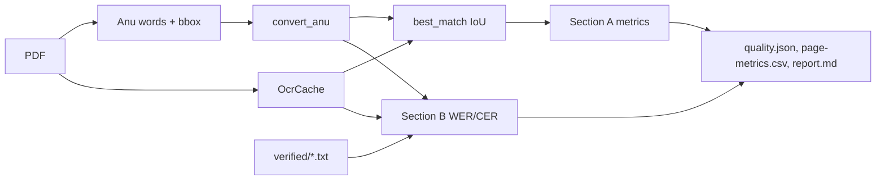

# Design: OCR quality report

## Problem & goals
`anu_unicode` converts the Anu-font glyph layer of Mahabharatamu.pdf to Unicode with a learned mapping; Tesseract (`tel`) is only the oracle used to learn it.
We want a report of how often Tesseract and the conversion disagree, page by page and overall, plus accuracy against human-verified text.

## Requirements / constraints
- Section A, Tesseract vs converted: every page with cached OCR (`--ocr-missing` adds the rest).
- Section B, ground truth: WER/CER of converted text and of raw Tesseract against `verified/`.
- Disagreements are not all conversion fixes: either side can be wrong (page 11: Tesseract right on `కాశీరాజు`). Section B is the proof.
- No new dependencies; reuse `OcrCache`, `best_match`, `split_words`, `convert_anu`.

## Proposed approach

`quality.py` holds pure metric functions; `quality_report.py` writes outputs; CLI subcommand `quality`.

## Alternatives considered
- Text alignment of whole pages instead of bbox matching: rejected, tokenization differs and errors cascade.
- `rapidfuzz` for edit distance: rejected, a 10-line helper avoids a dependency.

## Open questions
- None blocking. Tesseract must be reachable (`--tesseract` or `$TESSERACT_CMD`) for verified pages not yet cached.
