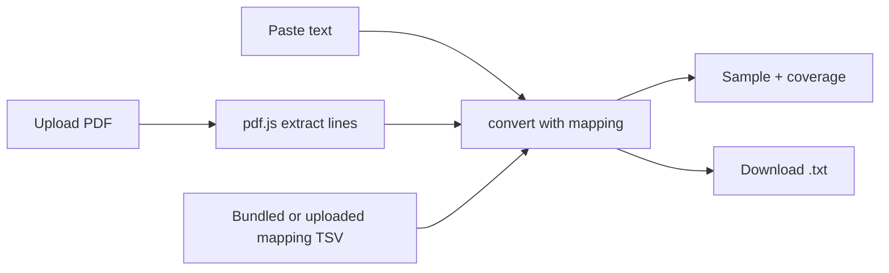

# Design: Client-side PDF to Unicode converter

## Problem & goals
Let a user convert a legacy Anu-encoded Telugu PDF to Unicode text without installing Python or running a server. The user uploads a PDF, picks a mapping, checks a sample, and downloads a `.txt`. If the browser cannot extract the glyphs, the user pastes text and gets converted text back.

## Requirements / constraints
- Fully client-side: no server, no network calls after the page loads.
- Mapping is the only conversion input (TSV: `glyphs<TAB>unicode`).
- Output is plain `.txt`.
- A sample of the first page with coverage % is shown before the full conversion.
- Output matches the Python CLI (`anu-unicode convert`) for the same pages and mapping.
- TypeScript, Vite, Vitest; pinned versions. Python code is untouched.

## Proposed approach
Static single-page app in `web/`. Conversion is pure text to text, so the Python logic is ported to TypeScript: longest-match segmentation, `normalise`, `markVisibleVirama`. pdf.js supplies the text lines.

Modules: `mapping`, `telugu`, `convert`, `profile`, `extract`, UI (`main`).

## Alternatives considered
- Pyodide: no port drift, but a large download and pymupdf is unavailable, so extraction still needs pdf.js.
- Server (FastAPI): ruled out by the requirement.

## Open questions
- Does pdf.js expose the raw Anu glyph codes? The spike decides whether extraction or paste is the primary path.
- Hosting: local static folder or published.
