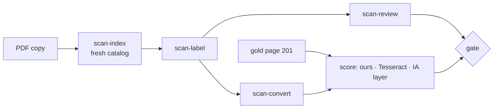

# Design: Scan-shape pipeline pilot on *Sriharsha Naishadamu*

## Problem & goals
The OCR-consensus and shape-name pipeline (`scan-ocr-consensus`, `scan-shape-names`) was built on one book, *Prasaaskhara Padakosamu*. This pilot runs it, unchanged, on a second book to find out:
- whether it carries over;
- what a new typeface costs: coverage with no review, and the size of the first review sheet;
- which assumptions were specific to Prasaaskhara.

## Requirements / constraints
- **Book.** `files/sriharsha-naishadamu/input/sriharshanaishad023794mbp.pdf` is a copy; the original stays in `files/large-scan/`.
  - 466 pages, 1-bit, 600 dpi, from the Internet Archive, with an IA OCR text layer.
- **Font folder.** `fonts/scan-naishadamu/scan/` starts empty. A missing `decisions.tsv` or `recipes.tsv` reads as empty.
- **Pages.** Pilot pages first: 6, 21, 101, 201, 301 and 401. The whole book waits for a go-ahead.
- **Gold.** Page 201, drafted by Claude from the image and corrected by the user.
- **Git.** Generated data stays in `files/` and `docs/temp/`, which git ignores.

## Proposed approach
Run the existing commands. Measure them against the gold, Tesseract word crops and the IA text layer. Fix code only for a root cause the pilot exposes.

### How this book differs from Prasaaskhara
| Aspect | Prasaaskhara | Naishadamu |
|---|---|---|
| Content | Telugu dictionary | Sanskrit verse plus Telugu commentary |
| Header and footer | Ornament rules | No rules; Arabic-numeral folio at the top |
| Type sizes | One body size | Verse set larger, bold headings |
| Body height | larger | 43 px |
| Punctuation | `=`, `.` | `=`, `:`, `ః`, `।`, `॥`, Telugu numerals |
| Subscripts | Small | Near body height in conjuncts (ష్ట, ద్య, జ్ఞ) |

## Alternatives considered
- **Reuse the Prasaaskhara catalog and decisions.** Rejected: the typeface differs, so its ids would not match.
- **Use the IA text layer as gold.** Rejected: it is another OCR, and page 51 comes out as garbage.

## Open questions
- Should the word band be the line's band rather than each word's own? See the findings in `status.md`.
- Should the `॥`, `।` and `:` marks get geometric rules like `=`, or reviewed labels?
