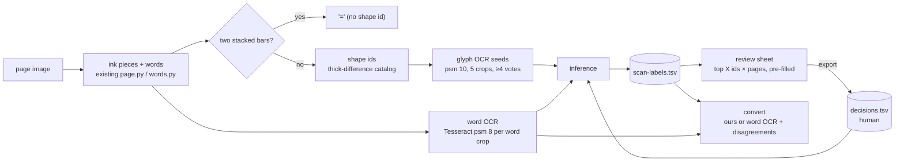

# Design: Scan OCR consensus — label shape ids from word OCR

## Problem & goals
The scanned-glyph pipeline (`docs/specs/scanned-glyph-mapping/`) stopped at "label page 67" because:
- **Humans labelled shape ids.** Review work grew with the number of clusters (5,021). One letter is spread over several ids, so each page's labels covered only 35–58% of the next page. On top of that came a hand-kept exclusion list of 151 ids.
- **The "border spike" was not caused by the page border.** The ornament bands are already dropped by the text-area cut. The real causes:
  - The 2,254 ids seen only once are glyphs that touch and fuse.
  - The noise ids are mostly the two bars of `=`, about 19% of all ink pieces.

**Goal:** about 97% word accuracy on the book with minimal human review. The human reviews one batch sheet, ranked across pages and pre-filled, instead of labelling one atlas per page.

## Requirements / constraints
- Start fresh from the PDF. Archive the old catalog, occurrences, OCR cache and `excluded.tsv`.
- Keep the page-51 ground truth as the answer key for evaluation only.
- Prove everything on 5 pilot pages (51, 67, 11, 103, 175) before running the whole book.
- No new runtime dependencies.

## Proposed approach

### `=` by geometry
A word is `=` when it has at least 2 pieces and every piece is a bar: height under 0.35 body height and width over 2.5 × its height. Its pieces get the `EQUALS` id instead of a catalog id, and the conversion writes `=`. This replaces `excluded.tsv`.

### Inference (`scan/inference.py`)
Inputs:
- each word's id sequence in drawing order;
- the word's OCR text, NFC-normalised and passed through `comparable`;
- seed labels: glyph-OCR proposals with at least 4 of 5 votes.

Steps:
1. **Solve.** For a word with 1 or 2 unlabelled ids, try candidate labels until `convert_anu` gives the OCR text.
   - The candidates are the Telugu pieces: consonants, vowels, signs, marks, `్`+C, `◌్`+C, C+sign, C+`్`, `◌`+sign, digits and punctuation, and `∅`.
   - Only candidates whose characters all appear in the OCR text are tried.
   - When several assignments fit, prefer the ones that give `∅` only to marks above or below the line, never to a main-band piece.
   - A word votes only when exactly one assignment fits.
2. **Accept.** An id takes its top label when that label holds at least 60% of the id's votes.
3. **Refine.** Re-solve every labelled id as if it were unknown, holding the others fixed, in every word where the rest is labelled. Relabel when at least 2 words and 60% of them agree on a different label. This step corrects seeds such as `గో`, which glyph OCR reads as `గ`.
4. Repeat until nothing changes.

Human decisions are fixed and never re-voted.

The result is written to `scan-labels.tsv` with the columns `shape_id`, `unicode`, `source` (`seed|words|review`), `support` and `agreement`.

### Review (`scan/review.py`)
- One HTML sheet for a page range: the top X undecided ids.
- Ordering: first the *flagged* ids (unlabelled, or `∅` on a main-band piece, or agreement below 0.6 (about the 7th percentile of frequent ids on the book; the median is 0.86)), then everything else, both by occurrence count.
- Each row shows: the shape strip from `scan-index/shapes/<id>.png`, an input pre-filled with the automatic label, the source and support, and 3 example words with their OCR text.
- The sheet exports `decisions.tsv` (`shape_id`, `unicode`). It is committed under `fonts//scan/`.

### Conversion (`scan/conversion.py`)
For each word:
- `=` becomes `=`.
- If every id has a label: use ours when it equals the word OCR or when the word contains a human-decided id. Otherwise use the word OCR, and record the word in `disagreements.tsv`.
- Otherwise use the word OCR.

### Removed
`scan-atlas`, `scan-pages`, the exclusion list (`--excluded`, `read_excluded`), and the name/recipe path for scans (`--names`/`--recipes` on `scan-convert`).

## Alternatives considered

| Option | Why not |
|---|---|
| Morphological frame/line removal | The data shows the bands are already dropped; the shape spike comes from fused glyphs. |
| Glyph OCR + word agreement (the first approved design) | Glyph OCR got only 45 of 77 ids right and fails on vowel signs and subscripts, so too few words would ever agree. |
| scikit-learn micro-model for rare and noise ids | The spike did not need it: `=` covers the noise and rare fused ids fall back to word OCR. Revisit if the full-book review load is too high. |
| Pair labels (recipes learned per host label) | Once refinement and the `◌`+sign candidates were in, none were learned. YAGNI. |
| Word OCR only | It has the same 94/99 baseline, but there is no way to fix Tesseract's systematic errors (ఁ, ద/ధ, ఱ) once per shape. |

## Spike evidence (pilot pages, `docs/temp/scan-v2/word_infer.py`)
- The `=` rule found 248 words (496 pieces).
- Automatic labels cover 87% of glyphs. Every id seen 10 or more times got a label.
- 391 of 397 fully labelled words agree with the word OCR.
- Automatic labels match the page-51 human labels for 131 of 134 ids.
- Page-51 exact words: 94/99 for both the merged output and Tesseract. The remaining misses are all systematic Tesseract errors that only a review fixes: ఁ (twice), ద/ధ, జ్జ and ఱ.

## Open questions
- What is the review load on the whole book? This is measured after the pilot gate.
- Where does a dropped ఁ come from? Tesseract never outputs it, so its id stays unlabelled and needs review.
