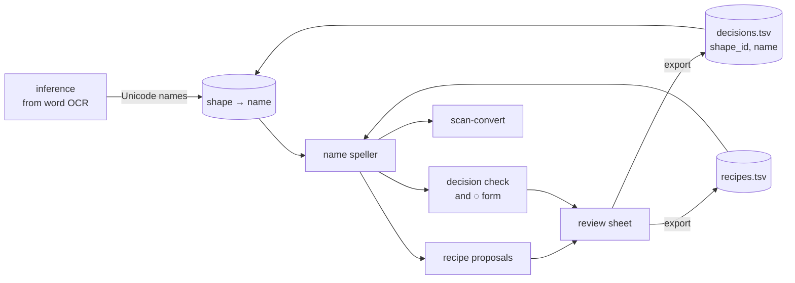

# Design: Scan shape names and recipes

## Problem & goals
Round 3 of `scan-ocr-consensus` reached 95/99 on page 51, against 94/99 for Tesseract. Most of the remaining errors come from one constraint: **every shape id must carry Unicode on its own.**

| Symptom | Words | Root cause |
|---|---|---|
| Reviewer names (`e_top`, `ai_bottom`, `ppu`, `blob`) had to be dropped or guessed | — | No place for a piece that has no standalone Unicode |
| 2431 `ai_bottom` → ∅: వైపు becomes వెపు | 26 | The ై tail only means something together with ె |
| `ె` instead of `◌ె` on 205 and 3918: ెపడతల | each id's words | A convention the reviewer has to remember |
| ఎ/ఏ, ా/ొ, డ్డ/ద్ద decision errors | about 120 | Nothing reports a decision that makes its words worse |
| ✓ head-mark: nothing on స, part of ో on గ | — | One piece, two meanings depending on context |

**Correction:** the "≈400 lost periods" counted in round 3 are not a regression. In 356 of 368 cases there is no ink after the word; Tesseract invents the `.`.

**Goals:**
1. A reviewer can give a shape a **name** where no Unicode fits.
2. **Recipes** turn sequences of names into Unicode.
3. The pipeline proposes recipes, catches harmful decisions, and applies the pre-base `◌` itself.

## Requirements / constraints
- Reuse the shape-naming conventions: a name is either Unicode or a symbol, and recipes use the `recipes.tsv` format (`names`, `unicode`, `note`) and `load_recipes`.
- Keep shape ids stable. The catalog, assignments and OCR caches stay in `state/`; round 3 is archived in `files/<book>/archive/2026-10-06-round3/`.
- Existing decisions migrate unchanged: a Unicode label is its own name.
- No new dependencies.

## Proposed approach

### 1. Names (`scan/names.py`)
- A name is **symbolic** when it contains an ASCII letter (for example `e_top` or `ai_bottom`). Any other name is Unicode, or `∅`, and stands for itself.
- **The name speller** gives every distinct name one private-use character. Its mapping has two parts:
  - each Unicode name maps to its text;
  - each recipe maps the concatenated characters of its names to its text.

  A word is spelled by converting its names' characters with the existing `convert_anu` (longest match first) and `finish`.
- This works at the level of names, not glyphs. `compile_mapping` would expand every recipe over all the duplicate ids of each name, which goes past its limit of 64 variants.
- A symbolic name that no recipe covers shows as a gap, so the word cannot agree with OCR and falls back to it.
- Validation at load time:
  - a recipe that uses an unknown name is an error;
  - two recipes for the same names with different Unicode are an error.

### 2. Inference (`scan/inference.py`)
- Labels are names.
- Unlabelled ids are still solved with Unicode candidates, but rendering goes through the speller. Recipes therefore apply while words are being solved, and a named piece next to an unknown one no longer blocks that word.

### 3. Pre-base `◌`, applied automatically
For every id whose name is a bare vowel sign (decided or inferred), compare how well `s` and `◌s` agree with word OCR across its words, and keep the better form. This changes how a label is written, not what it means, so it applies to decisions too.

### 4. Recipe proposals (`scan/recipes.py`)
- Take each complete word that disagrees with OCR and contains a symbolic name.
- For each adjacent pair (*previous name*, *symbolic name*), find the Unicode candidate that makes the word match its OCR. A word votes only when exactly one candidate fits.
- Votes pool across every id that carries those names.
- A pair becomes a proposal at **3 or more votes and a share of at least 60%**. Proposals are written to `recipe-proposals.tsv`.
- Proposals are never applied by themselves. The reviewer confirms them on the sheet.

### 5. Decision check
- For each decided id with at least 5 complete words, compute the share of those words that agree with OCR, and the most common difference (OCR → ours, from `difflib`).
- Flag the decision for recheck when agreement is below 0.6, *unless* the difference only adds a letter Tesseract cannot read (`TESSERACT_BLIND = {ఁ, ఱ}`).
- Flagged decisions appear at the top of the sheet with the difference pattern, for example `ై→ె in 26 words`.

### 6. Review sheet (`scan/review.py`)
Three sections:
1. **Decisions to recheck.**
2. **Recipe proposals**, each with a confirm box.
3. **Shape ids**, ranked as now.

Changes on the sheet:
- The label box accepts a name.
- Each row shows up to 3 sample words rendered with the current name, next to Tesseract's reading.
- The export downloads `decisions.tsv` (`shape_id`, `name`) and `recipes.tsv` (the earlier recipes plus the confirmed ones).

### 7. Word-final dots
No code change. Inspect the 12 cases that have ink right after the word. Revisit only if they are real periods.

## Alternatives considered

| Option | Why not |
|---|---|
| Keep labels Unicode-only and add more conventions | It treats symptoms (`◌`, ∅). Context-dependent pieces stay unsolvable. |
| `compile_mapping` glyph expansion | It goes past 64 variants with duplicate ids per name, and it is keyed by glyphs, not names. |
| Recipes learned per shape-id pair | The spike found too little data: one pair was learned on 5 pages. |
| Apply recipe proposals automatically | Proposals are learned from Tesseract, so they inherit its systematic errors. A human confirms each one. |
| Keep small specks to recover periods | 356 of 368 "periods" are invented by Tesseract. |

## Open questions
- Should a name ever cover more than one id-adjacency, for example a three-piece letter? Recipes allow any length; proposals only learn pairs (YAGNI).
- Is 0.6 the right threshold for the decision check? Calibrate it on round-3 decisions: it should flag 2431, 491, 1794 and 3889 and not flag the ఁ ids.
