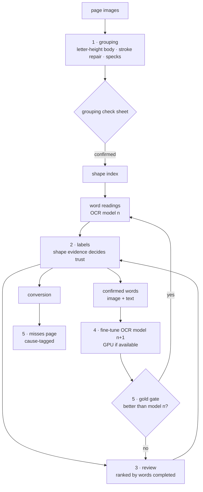
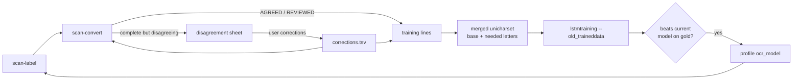

# Design: Scan workflow v3 — beyond the OCR ceiling

## Problem & goals
On *Sriharsha Naishadamu* the pipeline reached 63.5% exact words on page 201, against 55.3% for Tesseract. Almost every remaining miss is a Tesseract error passed through. The causes, traced in `docs/specs/scan-naishadamu-pilot/status.md`:
1. **Tesseract is the source of truth three times over:**
   - it proposes the labels;
   - it decides which labels we trust (agreement is measured against Tesseract);
   - it fills in every word we cannot read entirely ourselves.
2. **Grouping errors reach every later stage:**
   - specks become words that Tesseract reads as letters;
   - subscripts stranded by a stacking gap that is too small;
   - justified gaps that split one word into two.
3. **A label can be accepted on one word** (the full stop learned as `ఆ`).
4. **The stock `tel` model was trained only on synthetic text,** and it cannot output ఁ or ఱ at all.

**Goal:** near-perfect text, clearly beyond OCR, with review effort that grows with the number of distinct shapes in a book, not with how good Tesseract is on it.

## Requirements / constraints
- **Per book, not generic (user decision, 2026-10-07).** Each scanned book has its own workflow profile and mappings, all in `fonts/<scan-font>/scan/`:
  - `profile.json`: grouping and shape units, plus the thresholds;
  - `decisions.tsv` and `recipes.tsv`;
  - later, its fine-tuned OCR model.

  A book with no profile gets Prasaaskhara's validated values: the median unit, furniture 8.0, speck 0.3, word gap 0.45, stack gap 0.3 and bar 0.35. A change made for one book must leave the others untouched.
- Python 3.13, the existing scan commands, and per-book state in `files/<book>/`.
- **Use the GPU when one is available**, otherwise the CPU. This machine has an NVIDIA RTX 4000 Ada laptop GPU (CUDA 13.2 driver) and 22 CPU cores.
- No cloud OCR services. Improvement comes from fine-tuning on our own confirmed output.
- Gold pages are only ever used for scoring, never for training or labels.
- Prasaaskhara page 51 must stay at 95/99 or better whenever shared code changes behaviour under its (default) profile.

## Proposed approach

### 1. Grouping you can check without OCR
- **The height unit is a profile choice:** `median` (all pieces) or `letter` (the median of the pieces at or above the median). It is set separately for grouping and for shape normalisation. Each book's thresholds are tuned on its own gold pages: tuned on two, checked on the held-out third.
- **Stroke repair.** A small fragment that nearly touches a larger piece above or beside it joins that piece before clustering. This turns the broken ticks and heads (`slash`, `right_top`, `tick`, `*_base`) back into whole letters, and cuts the number of one-off ids.
- **Specks.** A piece far smaller than a dot with no letter nearby is dropped.
- **Grouping check sheet.** It lists the doubtful cases (single-piece lines, single-piece words, subscripts with no host, specks) as image strips to confirm or reject. Its decisions feed back into grouping.

### 2. Shape evidence decides trust
- **Our reading wins** when every id in the word is reviewed, or learned from at least `MIN_SUPPORT` words. It no longer has to agree with an OCR model.
- **A learned label needs at least `MIN_SUPPORT` words.** Labels below that go to the review queue.
- **A per-book confusion table** (OCR output → our reviewed text, for example `1→।` and `8→ః`) is learned from reviewed words. Those differences stop counting against decisions in the recheck.

### 3. Review ranked by words completed
- An id's priority is the number of words that would become fully readable by us once it has a label.
- Strips show each id boxed inside its words, and recipe drafts come with their supporting words.
- Each round covers 20 or more consecutive pages.

### 4. Fine-tuned OCR model
- **Training data:** word crops with their text from confirmed words (reviewed, or fully ours with support of at least `MIN_SUPPORT`), plus corrections typed on the misses page.
- **Model n+1** replaces model n for word readings only if it scores better on the gold pages.
- Trainer choice: see Open questions.

### 4b. Breaking the self-training plateau (after round 3)
- **Round 3 showed two limits:**
  - **AGREED lines are the model's own readings,** so more of them teach nothing new: 9× the data gave 6.3% → 6.2%.
  - **Letters missing from the character set,** such as `ఁ`, can never be produced.
- **Extended character set:** letters that confirmed lines need but the base model lacks are added to a merged unicharset. Training then runs with `--old_traineddata`, which keeps the base model's weights for letters it already knows.
  - **The starter must use the base's recoder.** The stock `tel` model uses a pass-through recoder: 136 unicharset entries give 136 output codes. The default compressing recoder re-coded all outputs (136 → 110), wiped the output layer and gave 11.3% on gold. With `--pass_through_recoder` the codes map one to one (136 → 137) and only new letters start fresh.
  - **The base's dictionaries are carried over** (`combine_tessdata -u`, `dawg2wordlist`, then `combine_lang_model --words/--puncs/--numbers`), so the book model keeps `tel`'s word, punctuation and number priors.
- **Letters Tesseract cannot read do not count as disagreement.** Conversion treats our reading as agreed when its only differences from OCR are `ఁ`/`ఱ` that OCR lacks (`TESSERACT_BLIND`, already used by inference). Without this rule, all 381 book words with `ఁ` were discarded as disagreements, so `ఁ` never reached the training lines.
- **Disagreement review:** complete words where our reading differs from the OCR reading are grouped by their difference pattern (for example `స`→`ప`) and ranked by count. A correction is entered once per word and goes into both conversion and training. These are the only lines that carry the model's real errors.
- **Faster labelling** lets each round be redone fresh: words are read page by page into a resumable cache, and inference is profiled.

### 5. Measurement
- **Three gold pages per book**, covering verse, commentary and `సమాసములు`.
- **A misses page after every round,** with each miss tagged by cause: `grouping`, `unlabelled`, `wrong label`, `ocr passthrough`.
- **The Prasaaskhara page-51 regression check on every change.**

## Alternatives considered
- **Cloud OCR (Google Vision and others):** ruled out by the user.
- **Keep the stock Tesseract and only add review:** coverage stays limited by what Tesseract reads correctly. The pilot showed that ceiling.
- **A per-piece image classifier:** superseded by a fine-tuned word model, which reads pieces in context and handles fused shapes.

## Open questions
- **Trainer:**
  - **Tesseract LSTM fine-tune from `tel_best`:** CPU only. Proven on small data, keeps the current integration, and adds ఁ and ఱ to its character set.
  - **PyTorch CRNN/CTC word recognizer:** uses the GPU, but it would be trained from our crops with no Telugu pretraining, so it needs more data.
  - Recommendation: Tesseract first, because the first rounds will have little data. Add the GPU model if Tesseract plateaus on gold.
- **`MIN_SUPPORT`:** start at 3 and measure the effect on gold.
