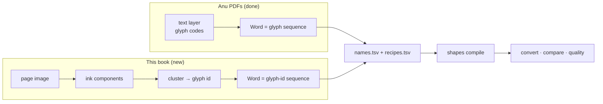
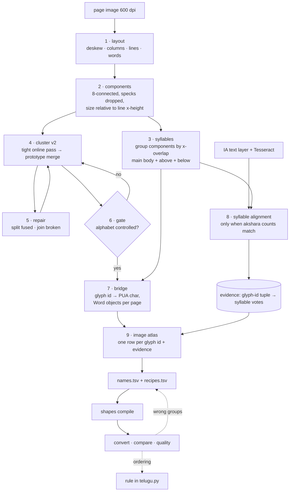

# Design: Scanned Telugu → Unicode via image glyph ids (Prasaaskhara Padakosamu)

## Problem & goals
`files/2015-395281-prasaaskhara-padakosamu/input/2015.395281.Prasaaskhara-Padakosamu.pdf` is 199 pages of 1-bit CCITT scans
(2645×4290 px on a 317×515 pt page, ≈600 dpi, `tiff2pdf`, no text layer, no fonts). It is a *prāsa* (rhyme) dictionary:
headword columns grouped by their second syllable (అంక, కంక, చంక …), each followed by `= meaning`.

Goal: reach the state the Anu books start from, a **finite glyph alphabet with a per-word glyph sequence**. From there the existing
shape-naming pipeline (names → recipes → `shapes` compile → `convert` → `compare`) runs unchanged.

The only new work is the left half of the *Scan* box. Everything right of `Word` is reused.

## Requirements / constraints
- Local and repeatable: Tesseract 5.4 `tel`, numpy/scipy/PIL. No cloud OCR.
- OCR **confirms**, it never defines a mapping (playbook lesson: Tesseract is systematically wrong on ఘ/ధ, ఛ/చ, ఢ/ధ, ఔ/జె).
- Glyph ids are stable across pages and re-runs: a persistent catalog per print run, grown incrementally.
- A human labels each glyph id **once** from an image atlas, not each word.
- Per-book data under `files/<book>/` (not committed). Per-typeface gold under `fonts/<encoding>/` as for Anu.
- Free evidence already exists: `files/2015-395281-prasaaskhara-padakosamu-text/…_text.pdf` is the Internet Archive copy with an
  invisible `GlyphLessFont` OCR layer (word text + boxes). It is noisy (`వాౌనాక్షర`, `చీ(కటితప్పూ`) but word boxes are usable.

## What we know already (POC `scripts/index_glyphs.py`, pages 4–13, archived run)
| Metric | Scan (POC) | Anu font (Mahabharatamu) |
|---|---|---|
| Distinct ids | 617 (294 singletons) | 207 glyph codes, 601 units |
| Top 300 coverage | 91.8 % | 99.65 % |
| Duplicates of one shape | yes (`ము` = id 68 **and** 246) | no |

So the image alphabet is **not yet font-like**. Three causes show up:
1. **Over-splitting**: greedy first-match against the *first* member, fixed 32×32 rescale, no shift tolerance. Scan noise
   (broken or thickened strokes) creates new ids.
2. **Scale blindness**: normalising to a square grid erases absolute size (`ం` vs `౦`, `ు` vs a small hook).
3. **Component ≠ glyph**: in letterpress a component is ink, not a type sort. Sorts that touch **fuse** (one component, two glyphs).
   Broken strokes **split** (two components, one glyph).

## Proposed approach

### Challenge to the requested order (syllable-first)
The request is OCR, syllable positions, cluster *syllables*, then decompose into components. Clustering whole syllables gives a
combinatorial alphabet: consonant × vowel sign × vattu is in the thousands, and most appear once. That is the
"learned 548 whole stacks" mistake from the Anu retrospective. So the two levels are used for different jobs:

| Level | Used for | Why |
|---|---|---|
| **Component → glyph id** (cluster) | the alphabet | bounded (≈ base forms + sign forms + vattus + digits/punctuation), same role as Anu glyph codes |
| **Syllable (akshara) = tuple of glyph ids** | positions and labelling | OCR text splits into aksharas, so a syllable is where OCR can be aligned to image. Same role as Anu *units* |

Syllable positions come from **geometry**, not OCR. OCR text is aligned to them only when the counts agree.

### Pipeline

1. **Layout.** Deskew from the dominant line angle. Columns from a vertical projection gap. Lines from a horizontal projection
   per column, then x-height and baseline per line. Words from the inter-component gap distribution: it has two clear modes,
   intra-word and inter-word.
2. **Components.** As in the POC, plus features that survive normalisation: height and width relative to line x-height,
   vertical offset from the baseline (above / main / below band).
3. **Syllables.** Within a word, components whose x-ranges overlap a main-band component join its akshara. Above-band
   components are the tick, ి, ీ and the ె/ే hooks. Below-band ones are the vattus and ు/ూ tails when detached. Canonical order inside
   an akshara: main left→right, then above, then below. This is the "drawing order" contract `telugu.normalise` already handles.
   Output `positions.tsv`: page, column, line, word, syllable, component bbox, band.
4. **Cluster v2.** Pass 1 is the existing online assignment with tight thresholds, so ids stay pure. Pass 2 recomputes each id's
   **prototype** (pixel-wise median of its members) and merges ids by a shift-tolerant distance (chamfer distance on the
   distance transform, ±2 px). The merge is gated by relative height and band so size-distinct shapes stay apart. Ids remain stable:
   a merge maps the newer id onto the older one in `merges.tsv`.
5. **Repair.**
   - *Fused*: a rare component that matches the horizontal concatenation of two frequent prototypes, within the same distance,
     is split at the best cut column.
   - *Broken*: two rare components that always co-occur at a fixed offset are joined into one glyph id. This is the Anu
     "unit" rule run backwards.
   Repairs are recorded per occurrence so the overlay shows them.
6. **Gate: is the alphabet font-like?** Measured on a page sample chosen by new-id yield, not the first pages. The ToC lesson
   is that front matter has low glyph diversity.

   | Metric | Pass |
   |---|---|
   | ids covering 99 % of occurrences | ≤ 400 |
   | new ids per page after the first 20 sample pages | < 1 % of that page's components |
   | singletons in the 99 % mass | 0 |
   | duplicate-shape spot check (atlas, top 100) | none |

   Pass: steps 7–9 use the shape-naming pattern as-is. Fail: the fallback below.
7. **Bridge.** Each glyph id becomes a private-use char `U+E000 + id`. Per page, build `glyphs.Glyph(char, bbox, origin_x, is_anu=True)`
   in canonical akshara order, plus `" "` glyphs at word gaps, so `glyphs.split_words`, `convert.convert_segments`,
   `shapes`, `compare` and `quality` work unchanged. The source seam is one function, `scan_lines(layout, page) -> list[list[Glyph]]`,
   used in place of `page_lines` when the book has no text layer. The encoding folder is `fonts/scan-prasaaskhara/`
   (catalog, names, recipes, profile).
8. **Syllable alignment (evidence, not truth).** For each word, take the IA text (box overlap) and the Tesseract word, and split each
   into aksharas (grapheme clusters). When an OCR akshara count equals the geometric syllable count, syllable *i* votes
   `glyph-id tuple → akshara i`. A vote counts per **distinct context** (neighbouring tuples), as in approach 1. Single-glyph tuples
   then propose a glyph's own contribution (`names.tsv` pre-fill). Multi-glyph tuples whose answer is not the concatenation
   propose a **recipe**. IA and Tesseract disagreeing marks the row for review.
9. **Image atlas.** Same columns and export as `shape_naming/atlas.py`, but the glyph image is the cluster prototype plus 6 member
   crops (spotting a wrong member), and the evidence columns come from step 8. The only atlas change is the image source.
   `render_png` from the embedded font becomes a crop provider.

### Free validation from the book's structure
Headwords in one block share their prāsa syllable. Within a block, the second syllable's glyph-id tuple must be identical. A
block where it differs points to a clustering error or a layout/syllable error, and needs no OCR. This becomes a check in `quality`.

### Fallback if the gate fails
Do not label a bad alphabet. Iterate steps 4–5 (thresholds, distance, repairs) against the gate. If fused shapes remain the
long tail after repair, label **syllable tuples** for that tail only, as recipes. `names.tsv` stays small and the tail stays
explicit.

## Alternatives considered
- **Cluster syllables directly** (requested order). Rejected as the alphabet: combinatorial, mostly singletons, the Anu stack-learning
  mistake. Kept as the labelling and alignment unit.
- **Tesseract output as the conversion.** No audit trail, systematic letter confusions, no way to fix one letter book-wide.
  We would ship IA's errors (`వాౌనాక్షర`).
- **Neural embeddings + HDBSCAN.** Better recall on degraded print, but heavy, non-deterministic across versions, and the
  print is one typeface on clean 600 dpi scans. Revisit only if cluster v2 misses the gate.
- **Train a Tesseract model on this typeface.** Needs the labelled data this pipeline produces anyway. A possible follow-on, not a start.
- **Pixel projection to cut letters.** Rejected for Anu, for the same reason here: it cuts inside letters and merges across them.

## Open questions
- Is the whole book one typeface and size? Headings and front matter may need their own encoding or exclusion, as the Anu probe
  drops non-Telugu fonts.
- How common are touching sorts? This decides whether *fused split* is required or optional. The page overlay will show it.
- Is the IA layer good enough to align on, or is it only a word-box source with Tesseract supplying the text?
- Digits and `=` share the page with Telugu. Do they get names in the same catalog? Proposed yes, like Anu symbol glyphs.
