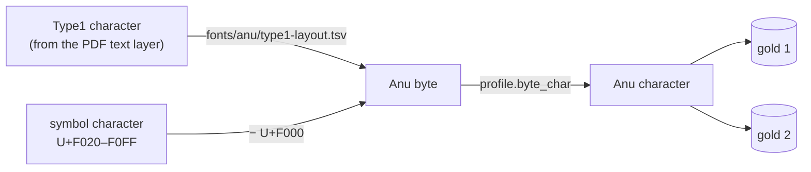

# Design: convert the Type1-layout volumes (8, 9, 12, 13)

## Problem & goals
Volumes 8, 9, 12 and 13 print their body text in Type1/CFF fonts (`PallaviBold`, `AnupamaMedium`, `AnupamaExtraBold`, `GowthamiExtraBold`, `GowthamiMedium`) that carry the same glyph designs as the other volumes' Anu fonts, but on different codes. The golds are keyed by Anu characters, so they read the wrong glyph and produce garbled words.

Goal: convert these volumes with the existing golds, with no second gold to maintain.

## How these fonts differ
| | Other volumes | Volumes 8, 9, 12, 13 (body text) |
|---|---|---|
| Font program | TrueType subset (`Type0`, Identity-H) | Type1/CFF, 181–230 glyphs per copy |
| Text layer | U+F020–F0FF = U+F000 + Anu byte | the glyph's own name turned into a character, with no ToUnicode and no `/Encoding` |
| Relation to the Anu byte | `character − 0xF000` | a fixed reshuffle, the same for every family and volume (Anu 0x41 is on `V`, 0x45 on `W`, …) |

Each of these volumes mixes both kinds: the headings are symbol-coded and the body is Type1. The layout is the same in all copies of a font inside a volume, in all three of Pallavi, Anupama and Gowthami, and across the four volumes. The independent tables built for Vols 9, 12 and 13 agree with Vol 8's on 208–218 of 220–227 characters, and the rest are duplicate or ambiguous shapes.

## Approach
Translate, then reuse the golds: the same idea as the symbol-code translation, with a different source of codes.



- **Table** `fonts/anu/type1-layout.tsv`: `char, codepoint, byte, score, margin, status, confirmed, candidates`.
  - `byte` is the best match; a value in `confirmed` overrides it.
  - It is built by `scripts/build_type1_layout.py`: render every glyph of the Type1 fonts, compare it with the same families' glyphs in the symbol-coded volumes (IoU, averaged over all the families), and solve the one-to-one assignment (`scipy` Hungarian), since every Anu byte occurs once. Duplicate shapes take their best match.
  - Rows with more than one plausible candidate were settled by counting real words: for each candidate byte, the share of Vol 8–9 words that convert to a word seen in the other 11 volumes. The margins were large (for example ె 75% against ే 3%), and one character, `–`, turned out to draw శ.
- **Per-book profile** `fonts/anu/books/<slug>.json`: the Anu profile plus `type1_layout` (the table) and, where needed, `type1_plain_pages`. `resolve_paths` uses it when it exists. Nothing changes for any other book.
- **Glyph reading** (`glyphs.page_lines`): on pages whose font list has Type1 fonts, characters of Type1 Anu fonts are translated through the table, then through `profile.byte_char`. Other Anu characters are canonicalised through their byte, so `∆`, the Ohm sign and `–` become Δ, Ω and `-`.
- **Exception**: page 425 of Vol 13 (the last page of the canto) uses a separate set of fonts with the conventional layout, so it is listed in `type1_plain_pages`. A per-page scan finds such pages, because garbled pages have most of their words unseen elsewhere: only this page was found among about 2,800.

## Checks
- Vol 8, pages 100–129: Tesseract agrees on 87.7% of words; every disagreement inspected was Tesseract's (ఇట్లు read as ఇట్టు, భీష్మపర్వము as భీష్మపర్వను, యుద్ధం as యుద్దం).
- Words unseen in the other volumes: 16–22.5% for the four converted volumes, against 20–21.5% for conventional volumes tested the same way (leave one out). The most frequent unseen words are valid names and compounds.
- All 16 converted books have 0 unmapped sequences; no conventional book changed.

## Building the table for a new book
```
python scripts/build_type1_layout.py --target <book> --reference <books with symbol-coded Anu fonts...> [--review "<chars>"]
```
Review sheets for the uncertain glyphs go to `files/<book>/output/intermediate/type1-layout/`.

## Open questions
- The 25 most ambiguous characters were settled by vocabulary, not by eye. A visual check of `files/maha-bharatham-vol-8-bheshma-parvam/output/intermediate/type1-layout/sheet-0*.png` would confirm them.
- Pages that use a different layout are found by hand (per-page word scan); a font-level detector would remove that step.
