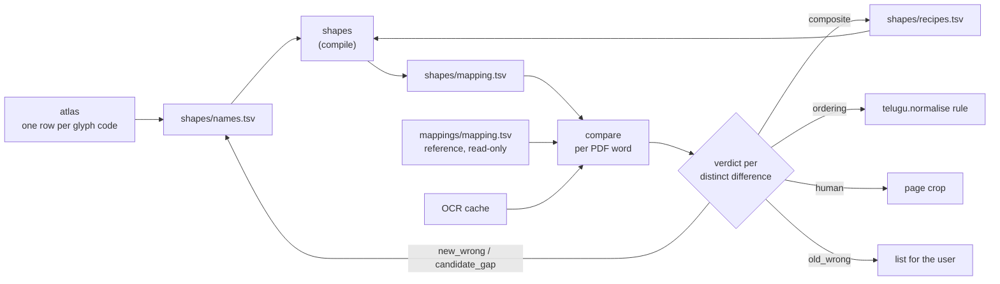
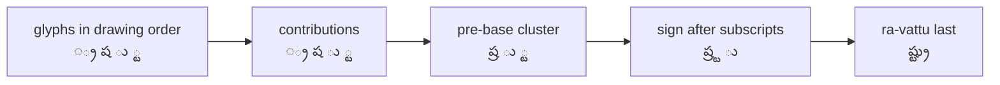

# Design: shape names + recipes

## Problem & goals
`mappings/mapping.tsv` maps glyph strings to Unicode. It needed ~650 entries, ~500 of them whole stacks, because labels were given per *unit*
(a glyph plus the zero-width marks merged onto it) and because some shapes mean nothing on their own (`=` + `∞` draws మ, `∞` after న is ు).

Goals:
1. Build a second mapping for `Mahabharatamu.pdf` **from scratch**, by naming each glyph code by its shape plus a short list of recipes.
2. Use it to **validate** the existing mapping: every disagreement is either an old error, a new error, or needs a human.

Non-goal: replacing or editing `mappings/mapping.tsv` (sha256 `92f81588…5846c74` must stay unchanged).

## Requirements / constraints
- The book has 601 units but only **207 distinct glyph codes**; 447 units are multi-glyph (mark `ˆ` sits on 48 hosts). Labels are per glyph code.
- Reuse the longest-match converter (`convert.convert_segments`), `telugu.normalise`, `mapping.save_entries`, `ocr.OcrCache` / `best_match`, `report._crop`.
- The labeller must not see the old mapping or old outputs. The atlas therefore never reads `--mapping`.
- `learn` / `confirm` keep working unchanged on any mapping file.

## Proposed approach

### Data (`shapes/`)
| File | Columns | Rules |
|---|---|---|
| `names.tsv` | `glyph name unicode` | One row per glyph code. `name` = shape, never role; several glyphs may share a name and must then share `unicode`. Empty `unicode` = meaningful only inside a recipe; `∅` = drawn but contributes nothing (the talakattu ticks). Pre-base pieces use `◌` (e.g. `◌్ర`, `◌ే`). |
| `recipes.tsv` | `names unicode note` | Space-separated names → Unicode. Visual composites only. |
| `mapping.tsv` | as the reference | Generated; never hand-edited. |

### Compile (`shapes.py`) — all violations raise `ShapeError`
1. Duplicate glyph row.
2. One name with two different `unicode` values.
3. A recipe with fewer than two names, or naming an unknown name.
4. A recipe expanding to more than 64 glyph strings.
5. A recipe whose glyph strings the *other* entries already convert to the same output, and that no other multi-glyph entry straddles (redundant).
   Comparing with plain concatenation is not enough: `va_base uu_hook sub_ya → వ్యూ` equals concatenation but is needed to beat the shorter `va_base uu_hook → మా`.
   The straddle condition keeps recipes that change how longest match splits their neighbours.
6. One glyph string with two outputs.

Output: single-glyph entries for every glyph with a contribution, plus the expanded recipes. Longest match makes recipes win over concatenation.

### What the font taught us
- Glyph order is **drawing order**. The మ/య closing hook comes after the vowel sign (మే = `va_base ee_hook u_hook`), and హ ends with a long tail glyph.
- Each consonant uses exactly one tick glyph, so ticks are named by host (`tick_ta`, `tick_pa`, …). This keeps recipes exact and under the variant cap.
- ై is written as ె + **ౖ** (U+0C56). Unicode defines ై as that pair, so NFC in `normalise` composes it whatever the glyph order. No recipe is needed.
- Ordering rules added to `telugu.normalise` (each with a test):
  1. a pre-base vowel sign (`◌ే`) moves after its consonant;
  2. a visible virama (్ + ZWNJ) moves after the subscripts drawn after it (పబ్లికేషన్స్‌);
  3. each run of subscripts is put in one canonical order, whatever order the glyphs came in: other subscripts as drawn, then ్ర, then ్య (ష్ట్ర, స్త్రీ, త్ర్య, దారిద్ర్య).
- **ZWNJ is a pipeline rule, not a mapping detail.** `convert.render` applies `telugu.mark_visible_virama` after `normalise`: a virama not followed by a consonant gets ZWNJ, whatever mapping produced it.
  A mid-word visible halant (షట్‌చత్వారింశ) is still written by the visible-virama glyph's own label (్ + ZWNJ), because only the shape knows it is visible.
  `normalise` itself stays ZWNJ-free so the solver can still match fragments such as a lone subscript virama.
- **Comparisons with outside text use `telugu.comparable`** (curly quotes folded, ZWNJ dropped): OCR votes and disagreements, gold pages, confirmations and the solver target. OCR and hand-typed text rarely carry ZWNJ, so it never counts as an error.
- Look-alike glyphs need separate names: `∂` (`hook_aa`, the మా tail) and `Ó` (`uu_hook`, ూ in వ్యూ) looked like one shape until ధౌమ్యాదులు split them.

### Compare (`compare.py`)
For every PDF `Word` (same `page_lines` → `split_words` walk as `quality`), convert the word with both mappings via `convert_anu`. Both sides walk the same words, so they align by construction.
Differences are grouped by `(glyphs, candidate, reference)`. OCR (`best_match` on the word box, cached pages only unless `--ocr-missing`) votes only on an exact match.

| Verdict | Rule |
|---|---|
| `candidate_gap` | the candidate output still has `⟦…⟧` |
| `old_wrong` | OCR matched the candidate, never the reference |
| `new_wrong` | OCR matched the reference, never the candidate |
| `human` | anything else (no OCR, OCR matches neither, or matches both) |

Outputs: `docs/temp/shapes-validation/diff.tsv` and `report.html` (page crop for `human` rows only).
There is no automatic "equivalent" verdict: `convert_anu` already applies `normalise` (incl. NFC) to both sides, so any remaining difference is a real one.

### Atlas
- One row per glyph code with count, code point, a zero-width flag, the two most common multi-glyph units containing it, and two example words.
- Glyph images are placed from the glyph's ink box (`Font.glyph_bbox`), so zero-advance marks, which ink to the left of their origin, are not clipped.
- Name + Unicode inputs, pre-filled from `--names`. *Download names.tsv* exports every row that has a name.
- `--top` is removed: a font has at most a few hundred codes, and a partial sheet would make the full export drop hidden rows.

### Exception triage
When a group shows the new mapping wrong:
- the shapes are right but come out in the wrong **order** → a rule in `telugu.normalise`, with a test.
- several shapes **draw** one letter → a recipe.
- a **label** is wrong → fix `names.tsv`.

## Alternatives considered
- **Name units (as first written):** brings back the per-host explosion of marks; rejected with data above.
- **Distinct names per role for one glyph:** impossible with one row per glyph, and role names would hide the shape. A recipe expresses the second role instead.
- **Edit the old mapping in place:** loses the independent reference; rejected by the user.
- **Context-sensitive recipes (left/right context):** not needed until `compare` shows a recipe over-firing across an akshara boundary.

## Open questions
- `verified/` is no longer in the working tree; only `tests/fixtures/page-6.golden.txt` served as gold.
- OCR is cached for 79 of 449 pages, and Tesseract is weak (63.6% word error on page 6), so most adjudication used spelling and page images.
- A print glyph slip (ర circle without tick for ం in పంచయజ్ఞ, p. 410) cannot be fixed by shape rules without misfiring elsewhere; a lexicon check would catch it.
- Decided: the canonical subscript order stays in the shared `normalise` and corrects 7 words in the reference conversion too.
- Independence is partial: the plan's evidence came from aggregate statistics of the old mapping.
