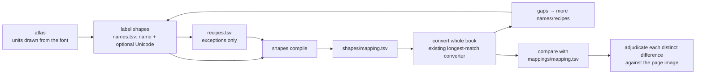

# Plan: shape names + recipes (a second, independent mapping for validation)

_Status: planned, not started. Written 2026-10-01 to be implemented in a fresh session. `design.md` and `status.md` for this folder are to be authored by that session before/while implementing (per CLAUDE.md)._

## Handoff (read first)
- **Do not modify `mappings/mapping.tsv`.** It is the validation reference. At the time of writing: 649 lines, `sha256 92f81588d76197fe6d3af887dfae91ef88c4449189afa89740f3e53ed5846c74`. Re-check the hash at the end.
- **While labelling shapes, do not open `mappings/mapping.tsv` or the old outputs** (`verified/`, `docs/temp/batch-*`). The point is an independent second mapping.
- Git: the repo has one commit containing only `mappings/mapping.tsv` and this plan. Everything else is untracked on purpose. Stage only what is asked; never stage the PDFs.
- Existing tooling to reuse: `atlas` (units drawn from the embedded font), `probe` / `profile`, `convert.convert_segments`, `telugu.normalise`, `mapping.py`, `learn` / `confirm`, `quality`. See `docs/specs/anu-telugu-to-unicode/new-font-playbook.md`.

## Context
The atlas asks for a Unicode value per glyph unit, but many shapes have none on their own. `=` (వ) plus the `∞` tail draws మ, and the same `∞` is the ు sign after న.
Labelling `∞` with a Unicode value is wrong or empty. The proposal: give every shape a **name** (`da_base`, `ta_base`, `aa_hand`, `ma_tail`) and describe how names combine.

Evidence from the existing mapping (648 entries; 601 distinct units in the book; read-only analysis):
- Only 253 units have an entry of their own. 348 units (`å` ా, `Ú`, `Ü«`, `Í`, …) exist only inside whole-stack entries, which is why the mapping needed ~500 combination entries.
- Once units carry a contribution, **242 of the 365 multi-unit entries are plain concatenation**. Many of the other 123 "exceptions" come from earlier wrong labels (`Ò` stored as రౌ, `Q` as గే, `^` ambiguous between ద and ద్).
  True recipes are things like `va_base + ma_tail → మ` (about 12 for the మ family) plus a handful more: **roughly 20–30 recipes instead of ~650 entries**.

Decisions already made by the user: leave the existing mapping untouched; use it only as the validation reference; build the new shape-based mapping for this book **from scratch** and compare.

## Scope
In: names/recipes model, `shapes compile`, atlas Name + Unicode columns, `compare` command, a from-scratch `shapes/` mapping for `Mahabharatamu.pdf`, validation report.
Out: migrating or editing `mappings/mapping.tsv`; changing the `learn` / `confirm` loop (it keeps working on the new mapping through `--mapping shapes/mapping.tsv --pending shapes/pending.tsv --progress shapes/progress.tsv`).

## Model (three small files under `shapes/`)
| File | Columns | Meaning |
|---|---|---|
| `names.tsv` | `glyphs  name  unicode` | One row per glyph unit. `name` describes the shape; several glyph variants may share a name. `unicode` is what the unit contributes alone when concatenated; **empty** for shapes with no stand-alone meaning (e.g. `ma_tail`). |
| `recipes.tsv` | `names  unicode  note` | Exceptions only: a space-separated name sequence and the Unicode it produces, e.g. `va_base ma_tail → మ`. |
| `mapping.tsv` | same as `mappings/mapping.tsv` | **Generated** by `shapes compile`; not hand-edited. |

Naming convention (free-form allowed; lowercase `[a-z0-9_]`): `<letter>_base` consonant body, `<vowel>_hand` vowel sign, `sub_<letter>` below-base consonant, `pre_<x>` drawn before its consonant, `<x>_tail` tail of a composite glyph, `mark_<x>` anusvara/visarga.

**Compile** (`shapes.py`): (1) every unit with a contribution becomes a single-unit entry; (2) every recipe is expanded over all glyph variants of its names (cartesian product, error above 64 variants) into glyph-string entries;
(3) a glyph string mapped to two different Unicode values is an error. The existing longest-match converter is reused unchanged: recipes win over per-unit concatenation, and `telugu.normalise` fixes ordering.

## Steps
- [ ] 1. **Atlas:** add **Name** and **Unicode** inputs; `--names shapes/names.tsv` pre-fills them; export becomes `names.tsv` format. The atlas must **not** read `mappings/mapping.tsv` (drop its `--mapping` pre-fill). Files: `atlas.py`, `cli.py`.
- [ ] 2. **`shapes.py` + `shapes compile`:** load/save names and recipes, expand, detect conflicts, write `shapes/mapping.tsv`. Reuse `mapping.save_entries` / `MappingEntry`.
- [ ] 3. **`compare.py` + `compare` command:** convert the PDF with a candidate and a reference mapping (`convert.convert_page`), diff word by word, group identical differences, write `docs/temp/shapes-validation/diff.tsv` and an HTML with a page crop per distinct difference (reuse `report._crop`) for adjudication.
- [ ] 4. **Label from scratch:** render the atlas as contact sheets (PNG), view them, write `shapes/names.tsv` for the 300 most frequent units (99.65% of occurrences), then the rest. Do not consult the old mapping while doing this.
- [ ] 5. **Iterate:** `shapes compile` → convert the whole book → list remaining gaps → add names/recipes (the మ family etc.) until gaps ≈ 0.
- [ ] 6. **Validate:** `compare` against `mappings/mapping.tsv` over all 449 pages. Classify each distinct disagreement as an error in the old mapping, an error in the new labels, or an equivalent spelling (by looking at the page). Fix the new labels; hand the user the list of old-mapping errors.
- [ ] 7. **Docs + hygiene:** author `design.md` and `status.md` in this folder (mermaid diagram above); extend `new-font-playbook.md` (label shapes, not Unicode); bump `pyproject.toml` to 0.4.0; confirm the `sha256` of `mappings/mapping.tsv` is unchanged.

## Files
New: `src/anu_unicode/shapes.py`, `src/anu_unicode/compare.py`, `tests/unit/test_shapes.py`, `tests/unit/test_compare.py`, `shapes/names.tsv`, `shapes/recipes.tsv`.
Modified: `src/anu_unicode/atlas.py`, `src/anu_unicode/cli.py` (`shapes compile`, `compare`, atlas `--names`), `tests/unit/test_atlas.py`, docs.
Reused unchanged: `convert.convert_segments` / `convert_page`, `telugu.normalise`, `mapping.py`, `glyphs.py`, `profile.py`, `learn` / `confirm` / `solve`.

## Risks & mitigations
| Risk | Mitigation |
|---|---|
| Visual labelling of glyph fragments may be wrong for ambiguous shapes | `compare` against an independent reference; adjudicate by page image; the user reviews the atlas names |
| Fragments with no clear role | Name by shape (e.g. `hook_left`) with an empty contribution; resolve through gap analysis and recipes |
| Same shape used in different roles (`∞` as the ు sign and as the మ tail) | Distinct names for distinct roles, chosen where recipes need them; `compare` exposes any merged wrongly |
| Independence is partial for the labeller who saw the old mapping earlier | Say so in the validation report; weight the user's review of disagreements higher |

## Verification / acceptance criteria
1. `lint.cmd` clean and `pytest` green. Unit tests: `shapes` (contribution → single-unit entry; recipe expands over every variant of its names; conflicting Unicode raises; variant cap enforced; recipe beats concatenation via `convert_segments`), `compare` (identical words not reported; differences grouped with counts; candidate gaps reported separately), `atlas` (Name and Unicode inputs; export has `glyphs`, `name`, `unicode`; only changed rows exported).
2. `sha256` of `mappings/mapping.tsv` identical to the value in **Handoff**.
3. The existing pipeline is unchanged: whole-book conversion with `mappings/mapping.tsv` still 100% and `verified/` pages identical.
4. New mapping: ≥ 99.9% of glyphs covered over the whole book; `compare` report on all 449 pages with every distinct disagreement classified.
5. Size check: `shapes/names.tsv` ≈ 300–600 rows and `shapes/recipes.tsv` ≈ 20–60 rows, versus 648 entries in the old mapping.
