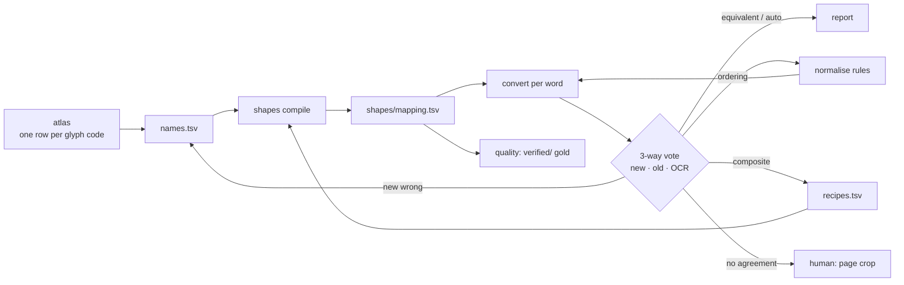

# Plan: shape names + recipes (a second, independent mapping for validation)

_Status: implemented 2026-10-01; see `status.md` and `validation.md`._

## Handoff (read first)
- **Do not modify `mappings/mapping.tsv`.** Validation reference: 649 lines, `sha256 92f81588d76197fe6d3af887dfae91ef88c4449189afa89740f3e53ed5846c74`. Re-check at the end.
- **While labelling, do not open** `mappings/mapping.tsv`, `verified/`, `docs/temp/batch-*`. Independence is partial (the plan and its review used aggregate stats from the old mapping); say so in the report.
- Git: stage only what is asked; never stage PDFs or anything >100KB.
- Reuse: `convert.convert_anu` / `convert_segments`, `telugu.normalise`, `mapping.save_entries` / `MappingEntry`, `ocr.OcrCache` / `best_match`, `report._crop`, `quality` command, `atlas.load_fonts` / `render_png`.

## Context
The atlas asks for a Unicode value per glyph, but many shapes mean nothing alone: `=` (వ) plus `∞` draws మ, and `∞` alone after న is ు.
Name every **glyph code by its shape** and describe the few combinations that are not plain concatenation as recipes.

Evidence (read-only scan of `Mahabharatamu.pdf`): 601 units, but only **207 distinct glyph codes**. 447 units are a glyph plus merged zero-width marks
(mark `ˆ` appears on 48 hosts, `Ô` on 42). So labels belong to glyph codes, not units. ~242 of 365 multi-unit entries in the old mapping are plain concatenation.
The rest are visual composites (recipes), ordering issues (`normalise` rules), or old label errors.

## Scope
In: names/recipes model, `shapes compile`, atlas per-glyph Name/Unicode, `compare` (3-way), `normalise` ordering rules found along the way, from-scratch `shapes/` mapping, validation report.
Out: editing `mappings/mapping.tsv`; changing `learn` / `confirm`.

## Model (`shapes/`)
| File | Columns | Meaning |
|---|---|---|
| `names.tsv` | `glyph  name  unicode` | One row per **glyph code**. `name` describes the shape (not its role); variants may share a name. `unicode` = stand-alone contribution (pre-base uses `◌`); empty = only meaningful inside a recipe. |
| `recipes.tsv` | `names  unicode  note` | Visual composites only, e.g. `va_base u_hook  మ  ma drawn as va+hook`. |
| `mapping.tsv` | as `mappings/mapping.tsv` | Generated by `shapes compile`; never hand-edited. |

Naming: lowercase `[a-z0-9_]`, shape-descriptive (`va_base`, `u_hook`, `sub_ka`, `mark_dot`, `hook_left`).

**Compile rules** (errors, not warnings):
1. Each glyph with a contribution → single-glyph entry.
2. Each recipe expands over every glyph variant of its names (cartesian; error above 64).
3. Same name with different `unicode` → error.
4. One glyph string → two outputs → error.
5. Recipe whose output equals concatenation of its parts (after `normalise`) → error (redundant).

**Exception triage:** ordering issue → rule in `telugu.normalise` + test; visual composite → recipe. Never encode ordering as a recipe.

## Steps
- [x] 0. Get a JIRA ID; branch `{proj}-xxx-shape-names`; write `design.md` + `status.md` (mermaid above). Keep `status.md` updated after every step.
- [x] 1. **Atlas** (`atlas.py`, `cli.py`): rows per glyph code (zero-width marks placed by their ink box, with 1–2 host units shown); Name + Unicode inputs; `--names` pre-fills;
      export the **full** `names.tsv`; stop reading `--mapping`; drop `--top` (all codes are shown, so the export never loses hidden rows).
- [x] 2. **`shapes.py` + `shapes` command**: load names/recipes, compile rules, write `--write shapes/mapping.tsv` via `save_entries` (never the global `--mapping`, which defaults to the reference).
- [x] 3. **`compare.py` + `compare`**: for every `Word` (`page_lines` → `split_words`) convert with candidate and reference via `convert_anu`; take OCR from `OcrCache` + `best_match`;
      group by `(glyphs, candidate, reference)` with counts; classify `old_wrong | new_wrong | candidate_gap | human`
      (no automatic `equivalent`: `convert_anu` already normalises both sides, so any remaining difference is real);
      write `docs/temp/shapes-validation/diff.tsv` + HTML (crops via `report._crop` for `human` rows only).
- [x] 4. **Label from scratch**: contact sheets of the atlas; write `shapes/names.tsv` for all ~207 glyph codes, most frequent first.
- [x] 5. **Iterate**: compile → `compare` → act on `new_wrong` / gaps (fix name, add recipe, or add `normalise` rule) until gaps ≈ 0 and `new_wrong` = 0.
- [x] 6. **Validate**: `quality --mapping shapes/mapping.tsv` (gold: `verified/`); final `compare` over 449 pages; adjudicate `human` rows by page image; hand the user the `old_wrong` list.
- [x] 7. **Docs + hygiene**: update `new-font-playbook.md` (label shapes per glyph code); bump `pyproject.toml` minor; confirm the `sha256`.

## Files
New: `src/anu_unicode/shapes.py`, `src/anu_unicode/compare.py`, `tests/unit/test_shapes.py`, `tests/unit/test_compare.py`, `shapes/names.tsv`, `shapes/recipes.tsv`.
Modified: `atlas.py`, `cli.py`, `tests/unit/test_atlas.py`; possibly `telugu.py` + its tests (ordering rules only); docs.

## Risks & mitigations
| Risk | Mitigation |
|---|---|
| Same shape, different meanings (`∞`) | Name by shape; most common contribution on the glyph; other readings as recipes. |
| Recipe fires across an akshara boundary (context-free longest match) | `compare` groups by glyph sequence, so over-firing appears as one group; each recipe carries a `note`. |
| Tesseract is weak on conjuncts | OCR only votes on exact match; all other cases go to a human. Missing OCR → `human`. |
| `verified/` originated from the old mapping | Treated as gold because humans approved it; disclosed in report. |
| Partial independence of the labeller | Disclosed; the user reviews `human` and `old_wrong` groups. |

## Verification / acceptance criteria
1. `lint.cmd` clean; `pytest` green. Tests: compile rules 1–5; recipe beats concatenation via `convert_segments`; `compare` per-word alignment, grouping, each classification; atlas per-glyph rows, carrier render for zero-width, full export.
2. `sha256` of `mappings/mapping.tsv` unchanged; old pipeline still 100% and `verified/` unchanged.
3. Gold: `quality --mapping shapes/mapping.tsv` → 100% word match on `verified/` pages (or each diff adjudicated as old error).
4. Coverage ≥ 99.9% over the whole book; `compare` has 0 `new_wrong`, every `human` group adjudicated.
5. Size: `names.tsv` ≈ 207 rows; `recipes.tsv` ≈ 20–40 rows, each with a note; any new `normalise` rules listed in `design.md`.
