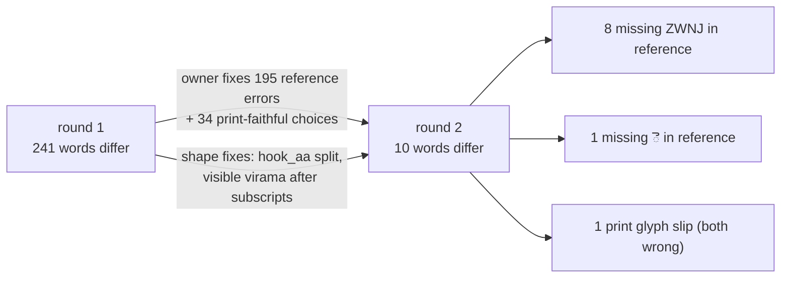

# Validation: shape mapping vs `mappings/mapping.tsv`

_Run on 2026-10-01 over all 449 pages of `Mahabharatamu.pdf` (77,191 words), in two rounds._

## Headline
| | Shape mapping (`shapes/`) | Reference round 1 | Reference round 2 (corrected) |
|---|---|---|---|
| Hand-maintained rows | 207 names + 50 recipes | 648 entries | 654 entries |
| Generated entries | 517 | — | — |
| Glyph coverage | 100% | 100% | 100% |
| Gold page 6 (88 words) | 0 errors | 0 errors | — |
| Words that differ from the shape mapping | — | 241 (0.31%) | **10 (0.013%)** |

## Round 1: reference errors found (since fixed by the owner)
| Reference wrote | Correct | Words | Examples (page) |
|---|---|---|---|
| ష్ట | ష్ఠ | 135 | శర్మిష్ఠ (10), జ్యేష్ఠుడు (83), షష్ఠితమ (57), శ్రేష్ఠుడు |
| ఫూ | ఘా | 19 | ఆఘాతము (211), పదాఘాతము (123), మేఘాచ్ఛాదిత (281) |
| ఫ్రూ | ఘ్రా | 11 | ఆఘ్రాణించెను (117), వ్యాఘ్రాది (66) |
| గ్గ | గ్ధ | 13 | దగ్ధులైన (8), ముగ్ధుడైన (314) |
| ధ్యౌు | ధౌమ్య | 13 | ధౌమ్యపురోహితుడు (193) |
| ద్రౌ / రౌ for `Ò` | ౌ | 3 | దౌత్య (277), ద్విపంచౌ (135) |
| భ్భ | బ్బ | 1 | తబ్బిబ్బు (45) |
| భ for a stroke-less subscript బ | బ (as printed) | 34 | ధనుర్బాణములు (121), బర్బర (154); print typos గర్బవతులై (318), గర్బమునందు (36) |

## Round 2: remaining differences (10 words)
| Word (page) | Shape mapping | Reference | Verdict |
|---|---|---|---|
| మరుక్‌ (44), వివశ్వాన్‌ (60), తిర్యక్‌ (61), హైదరాబాద్‌ (4), పబ్లికేషన్స్‌ (4), ఏషియాటిక్‌ (199), మహాన్‌ (83), ఋక్‌ (258) | ్ + ZWNJ | ్ only | Reference: needs ZWNJ to keep the visible virama |
| మనకెట్టి (130) | మనకెట్టి | మనకట్టి | Reference: missing ె (confirmed by owner) |
| పంచయజ్ఞములందు (410) | పరచయజ్ఞ | పరెచయజ్ఞ | Both wrong: the PDF uses the ర circle without a tick where ం is meant. It is the only bare circle before a consonant in the book, so it is left as a print glyph slip rather than a rule |

## Round 3: ZWNJ made a pipeline rule
Every converter output now gets ZWNJ after a virama that is not followed by a consonant, so the 8 ZWNJ differences close without editing the reference.
The shape mapping and the corrected reference now differ on **2 words** in the whole book: మనకెట్టి (130, reference missing ె) and పంచయజ్ఞ (410, print glyph slip).
On the 10 sample pages (6–10, 30, 60, 150, 300, 440) they agree word for word, and both differ from the old batch outputs in the same 11 words, all of them batch errors.

## Round 4: last reference fix (full agreement)
మనకెట్టి exposed two compensating reference errors. Six entries glued the pre-base ె glyph `Ô` onto the consonant before it
(`#Ô`, `@Ô`, `}Ô`, `ÅÔ`, `~°Ô`, `^ÕÔ`), and bare `~` → రె put the ె back whenever ర followed.
They were replaced by `Ô` → `◌ె` and `~` → ర. This changed exactly 2 words (మనకెట్టి, పరచయజ్ఞ).
**The shape mapping and the reference now agree on all 77,191 words.**

పంచయజ్ఞ (p. 410) still converts as పరచయజ్ఞ in both: the PDF encodes a ర circle where ం belongs. That is a source typo, outside any mapping.

## Shape-mapping fixes made in round 2
- **`∂` (U+2202) split from `uu_hook` as `hook_aa`.** వ్యూహము uses `Ó` and ధౌమ్యాదులు uses `∂`. They are different glyphs, so they are not a homograph, and the వ్యూ recipe is no longer needed.
- **Visible virama after subscripts.** The virama glyph is drawn before a following subscript but belongs after it (పబ్లికేషన్స్‌).
- Owner confirmations: యుథిష్ఠిర (31) is what the print says; ధౌమ్యాదులు (380) and మనకెట్టి (130) are correct.

## Change to the reference pipeline (accepted by the owner)
The canonical subscript order in `telugu.normalise` corrects 7 words in the reference conversion:
సత్ప్రవర్తన (91, 99, 101), దుష్ప్రాప్యమైన (206), శాస్త్రోక్తముగా (215), అస్త్రోపసంహారములను (311), దిగ్భ్రాంతులై (439).

## Caveats
- Independence is partial: the plan and its review used aggregate statistics from the reference, and the compare loop showed reference outputs during iteration.
- OCR votes exist only for 79 cached pages; Tesseract has 63.6% word error on page 6, so most groups were adjudicated by spelling, page images and the owner.
- `verified/` was not in the working tree; only `tests/fixtures/page-6.golden.txt` served as gold.
