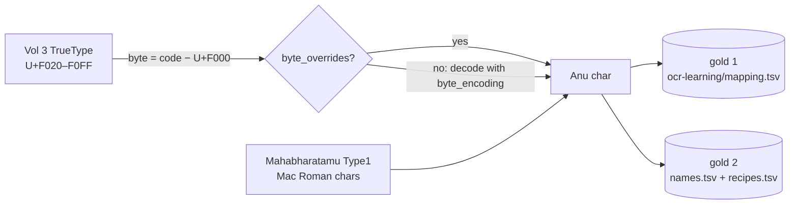

# Design: convert Maha Bharatham Vol 3 Sabha Parvam with the Anu golds

## Problem & goals
`files/Maha Bharatham Vol 3 Sabha Parvam.pdf` (404 pages) is the third book. It looked multi-font: "Gautami" (assumed Unicode) plus Anu fonts that might need an offset. The goal is to convert it with the existing Anu golds (`fonts/anu/`), extending both golds only for the codes this book adds.

## Findings
Measured on the whole book by rendering glyphs from each PDF's embedded fonts:

1. **No Unicode Telugu font.** The font is **Gowthami** (Thin/Medium/Bold/Black/ExtraBold), an Anu-family ASCII font, not Microsoft's Unicode *Gautami*. Every Telugu font emits Private Use Area codes U+F020–U+F0FF, the Windows symbol-font convention (U+F000 + byte). Only Times/Arial (about 900 characters of English) are real text.
2. **The offset is exact.** Mahabharatamu's Type1 fonts give each Anu byte as the character Mac Roman decodes it to; Vol 3's TrueType fonts give the same byte at U+F000 + byte.
   - Same typeface, same code, rendered from each book's font: Priyaanka (163 codes), PriyaankaBold (123), PallaviBold (170), Kranthi (18) and Prabhava (12) draw identical glyphs for every shared code.
   - Three bytes come out under a different glyph name in Mahabharatamu: 0xC6 → `Δ`, 0xDB → `¤`, 0xD0 → `-`.
   - Mahabharatamu's own PUA characters are U+F8FF, Mac Roman's byte 0xF0, which confirms the decoding.
3. **Gowthami, Anupama, Dharani and Brahma are the same encoding in a different design.**
   - Their zero-width mark codes are the Anu mark codes.
   - After translation, the existing golds leave about 1.9% of Telugu glyphs unmapped (GowthamiThin 9.5k of 525k, AnupamaMedium 1.2k of 243k, PallaviBold 2.5k of 115k).
   - The converted text reads correctly.
4. **About ten codes are new to the golds.** Readings so far are guessed from context, to be confirmed on contact sheets:

   | byte | Anu char | count | context | likely |
   |---|---|---|---|---|
   | AB | `´` | 6717 | `ఇట్లు⟦´⟧`, `స్థల⟦´⟧ప్రియురాలైన` | the separator in word glosses |
   | 96 | `ñ` | 3080 | `నారదు⟦ñ⟧డు`, `గడ⟦ñ⟧గి` | ఁ |
   | B5 | `µ` | 1352 | `కృష⟦µ⟧్ణడు`, `భీష⟦µ⟧్మడు` | ు drawn after a subscript |
   | A4 | `§` | 937 | `వెళా⟦§⟧డు`, `మళీ⟦§⟧` | ్ళ |
   | 49 | `I` | 905 | standalone in verses; `డా⟦II⟧` | bar marks |
   | 43 | `C` | 482 | `అప⟦C⟧డు`, `ఒప⟦C⟧గా` | ్పు |
   | B9 | `π` | 42 | `ఎస⟦π⟧.`, `ఆఫ⟦π⟧` | virama |
   | AD | `≠` | 6 | `ర⟦≠⟧` | to check |

5. **One ordering error.** `÷û` converts to `్థ్స` where the print reads `్స్థ` (వక్షస్స్థలం, తత్స్థానీయ; 3 words).
6. **Minor fonts:**
   - `TeluguNumbers*` emits only hyphens (24) and `DingbitsThree` 3 ornaments.
   - `Priyaanka,Italic` and `GowthamiBold,Bold` carry a style suffix after the family name.

## Requirements / constraints
- One encoding, one pair of golds: `fonts/anu/ocr-learning/mapping.tsv` and `fonts/anu/shape-naming/{names,recipes}.tsv`. Each grows by its own process and the two are cross-checked.
- Mahabharatamu conversion stays byte-identical.

## Proposed approach
The PUA form is how a TrueType PDF stores the same Anu byte. It is a property of the PDF's text layer, not a new encoding, so it is normalised at extraction time and nothing downstream changes.

- `FontProfile` gains:
  - `byte_encoding`: the codec that turns a byte into the encoding's character; `mac_roman` for Anu, `latin-1` by default;
  - `byte_overrides`: bytes whose character differs from that codec; the three above for Anu.
- `fonts/anu/profile.json` lists the new families: Gowthami{Thin,Medium,Bold,Black,ExtraBold}, Anupama{Medium,Bold,ExtraBold}, Dharani and Brahma.
- `glyphs.font_family` drops a `,Style` suffix.
- `glyphs._span_glyphs` turns symbol codes into characters:
  - Anu fonts use the profile;
  - other fonts get the plain byte, so the TeluguNumbers hyphens come out as `-`.
- New codes are named in gold 2 from `sheets`/`atlas` on Vol 3, and learned into gold 1 with `learn`/`confirm` on Vol 3. `compare` and `quality` then cross-check them.

## Alternatives considered
- **A separate `fonts/anu-pua/` encoding.** Duplicates both golds, which would then drift apart.
- **Re-keying both golds by byte.** Rewrites about 650 + 207 rows and every test fixture for no behavioural gain.
- **Per-glyph encoding switch** (the refactor design's follow-up). Not needed: every Telugu font in Vol 3 is the Anu encoding.

## Open questions
- Unicode for the bar marks (`|`, `॥`, or the ASCII bars as printed), and the gloss separator `´`. These are decided when naming from the contact sheets.
- `÷û`: a recipe for `్స్థ`, or a canonical order rule if more cases appear.
- The 3 DingbitsThree ornaments come out as letters; they are left unmapped.
